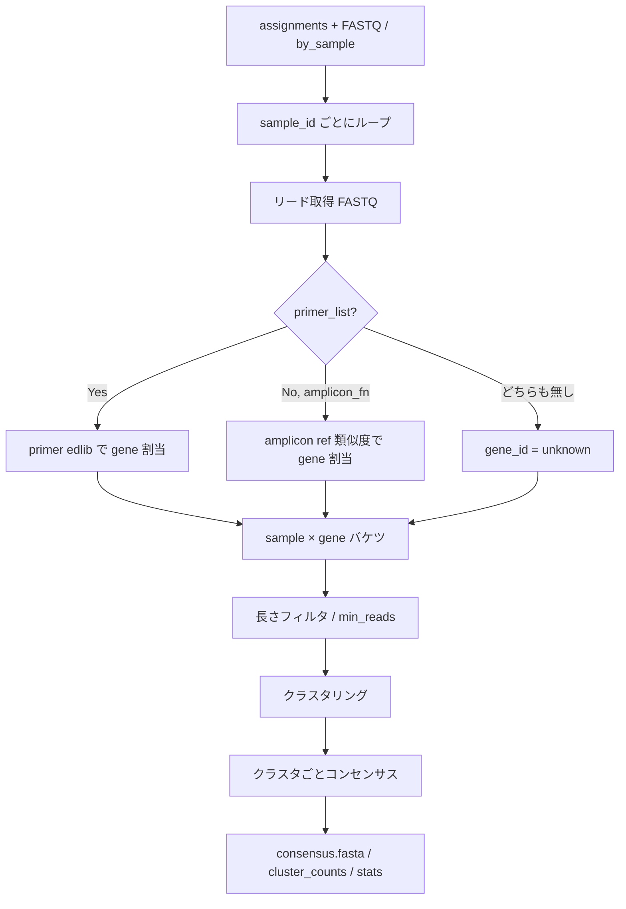

# doAmpliconResolve 実装計画（ref-aware）

作成日: 2026-07-09  
関連:
- [cursor_dev/pipeline_revise.md](pipeline_revise.md) — パイプライン全体・§6 Step 2
- [cursor_dev/demux_revise.md](demux_revise.md) — Step 1 入出力契約
- [cursor_dev/code_reorganize_plan.md](code_reorganize_plan.md) — 旧 `doAlign` 配置の参考

対象: 新ファイル `R/amplicon_resolve.R`（`export(doAmpliconResolve)`）

---

## 1. 目的

demux 済みリード（`assignments.tsv` + FASTQ / `by_sample`）から、**サンプル単位**に:

1. **遺伝子（アンプリコン）割当**（ref-aware）
2. **クラスタリング**および/または**コンセンサス**
3. 下流 editcall が消費できる代表配列・頻度表の出力

を行う。現行 `doAlign`（全リード × amplicon DB BLAST → 巨大表）を **置換**する。

採用方針（[pipeline_revise.md §6.3](pipeline_revise.md)）:

| 選択肢 | 採用 |
|--------|------|
| A. クラスタリングのみ | 内部ステップとして使用 |
| B. コンセンサスのみ | 内部ステップとして使用 |
| **C. ref-aware** | **本線**: amplicon DB / primer で遺伝子割当後に A/B |

```
[assignments + FASTQ | by_sample]
        ↓  サンプル単位でリード取得
[gene assign: primer edlib (+ 任意 amplicon ref)]
        ↓  sample × gene バケツ
[長さフィルタ → クラスタ → 上位クラスタのコンセンサス]
        ↓
amplicon/{sample_id}/consensus.fasta + cluster_counts.tsv + ...
```

---

## 2. 現行 `doAlign` からの差分

| 旧 `doAlign` | 新 `doAmpliconResolve` |
|--------------|------------------------|
| サンプル非依存（全リード一括 BLAST） | **サンプル単位**処理 |
| 出力はリード単位の巨大 `alignment_list.csv` | **クラスタ/コンセンサス中心**の小表 |
| PAM/edit-site 切り出しまで含む | **遺伝子割当 + 配列再構成のみ**（PAM 判定は Step 3） |
| BLAST 必須 | **edlib primer 本線**（既存 C++ edlib 資産を再利用）。BLAST は任意フォールバック |
| FASTA 前提 | **FASTQ**（quality は将来のコンセンサスで利用可能） |

`doAlign` 内の intact / PAM window ロジックは **editcall 再設計側へ移す**。本関数は「どの遺伝子か」「どんな代表配列か」まで。

---

## 3. 決定事項（本計画で固定）

| 項目 | 決定 |
|------|------|
| 処理方針 | **C. ref-aware** |
| 遺伝子割当の主手段 | **primer pair の edlib アンカー検出**（demux と同じ思想） |
| `amplicon_fn` | **任意の補助 ref**（期待長・向き確認・ref-guided 検証・割当フォールバック） |
| サンプル I/O | `by_sample/*.fq.gz` があれば優先。無ければ `assignments` + 元 FASTQ から抽出 |
| 初期アルゴリズム | **Phase C0**: 遺伝子割当 + 多数決/同一配列集計。**Phase C1**: 簡易クラスタ + spoa系コンセンサス（または R 内多数決 MSA） |
| 外部重量ツール | 初期は **必須依存にしない**（vsearch / isONclust / medaka は後段オプション） |
| `doAlign` | Phase C 完了後に **deprecated → 削除**。当面共存可 |
| PAM / genotype | **本関数のスコープ外**（`doEditcall` 再設計で消費） |

---

## 4. API 契約

### 4.1 公開シグネチャ

```r
doAmpliconResolve <- function(
  assignments,                 # path or data.frame (read_id, sample_id, ...)
  out_dir,                     # 通常 {run}/amplicon
  fastq = NULL,                # 元 FASTQ（sample_fastq_dir が無いとき必須）
  sample_fastq_dir = NULL,     # demultiplex/by_sample
  primer_list = NULL,          # CSV: primer_id, seq（_F/_R）。マルチ gene 時は推奨/必須相当
  amplicon_fn = NULL,          # prepAmpliconDB の amplicon.fa（任意）
  method = c("both", "cluster", "consensus"),
  min_reads = 5,               # sample×gene に使う最小リード数
  min_cluster_reads = 5,       # クラスタを出力に残す最小 read 数
  max_clusters = 20,           # サンプル×gene あたり上位クラスタ数の上限
  max_primer_edit = 3,         # primer edlib 許容編集距離
  end_window = 80,             # リード両端での primer 探索窓
  length_tolerance = 0.25,     # expected_len ±25%（amplicon_fn がある場合）
  samples = NULL,              # 処理する sample_id 部分集合（NULL=全部）
  n_core = 1,
  overwrite = FALSE
)
```

### 4.2 引数ルール

| 条件 | 挙動 |
|------|------|
| `sample_fastq_dir` ありかつ該当 `.fq(.gz)` 存在 | それを読む |
| 無し | `fastq` + `assignments` からサンプル単位抽出（内部または一時 `by_sample`） |
| `primer_list` あり | **マルチ gene 割当 ON**（本線） |
| `primer_list` 無し・`amplicon_fn` あり | amplicon 配列へのグローバル類似度で gene 割当（フォールバック） |
| 둘とも無し | gene を `unknown` として 1 バケツでクラスタ/コンセンサス（単一 gene 実験向け） |
| `method = "cluster"` | クラスタ代表のみ（コンセンサス計算スキップまたは代表=最頻配列） |
| `method = "consensus"` | ほぼ 1 クラスタ扱い（または全リードから 1 本の合意配列） |
| `method = "both"` | クラスタ + 各クラスタ合意（**推奨デフォルト**） |

### 4.3 戻り値

```r
AmpliconResolveResult <- list(
  samples = character(),          # 処理した sample_id
  out_dir = character(1),
  table   = data.frame(),         # 全 sample の cluster_counts 縦結合
  gene_assignments = data.frame() # 任意: read→gene 診断表のパス or 要約
)
```

`pipeline_revise.md` §11 の契約と一致させる。ファイルパス中心でもよいが、少なくとも `table` はメモリ上で返す。

---

## 5. 入出力ディレクトリ

### 5.1 入力（Step 1 から）

```
demultiplex/
  assignments.tsv          # 必須（または data.frame）
  by_sample/{sample_id}.fq.gz   # 任意だが推奨
```

`assignments.tsv` 必須列: `read_id`, `sample_id`  
（他列は無視してよい。`source_file` は複数 FASTQ 抽出時に利用可）

### 5.2 出力（本 Step）

```
amplicon/
  summary_by_sample.tsv           # 全サンプル横断サマリ
  gene_assignments.tsv            # 任意・診断: read_id, sample_id, gene_id, strand, ...
  {sample_id}/
    consensus.fasta               # >{gene_id}|{cluster_id} または >{gene_id}
    clusters.fasta                # クラスタ代表配列（任意だが both では書く）
    cluster_counts.tsv
    stats.tsv
    reads_by_gene/                # 任意・デバッグ: 中間 FASTQ（デフォルト OFF）
```

### 5.3 `cluster_counts.tsv`

```tsv
sample_id
gene_id
cluster_id
n_reads
fraction          # gene 内割合
fraction_sample   # sample 内割合
n_reads_gene
method            # majority|spoa|...
```

### 5.4 `stats.tsv`（サンプルごと）

```tsv
sample_id
n_reads_in
n_reads_assigned_gene
n_reads_unassigned_gene
n_genes_detected
n_clusters_total
n_skipped_low_count     # min_reads 未満で落とした sample×gene
elapsed_sec
```

### 5.5 `consensus.fasta` / `clusters.fasta` ヘッダ

```
>{gene_id}|cluster_{k};size={n};sample={sample_id}
```

下流 editcall が `gene_id` をパースできるよう、`|` 区切りを固定する。

---

## 6. 処理パイプライン（詳細）



### 6.1 サンプル単位リード取得

優先順:

1. `file.path(sample_fastq_dir, paste0(sample_id, ".fq.gz"))`（または `.fq`）
2. 無ければ `fastq` をストリームし、`assignments$read_id` で当該サンプルのみ抽出  
   - 実装: 既存 `splitDemultiplexReads()` を **サンプル部分集合**で呼ぶ、または内部ストリーミング抽出
3. `n_reads_in < min_reads` なら当該サンプルは `stats` だけ書いてスキップ

メモリ注意: 全サンプルを同時にメモリに載せない。`n_core > 1` でも **サンプル並列**（遺伝子並列は後で検討）。

### 6.2 遺伝子割当（ref-aware 本線）

demux と同様、**固定 primer は位置・向きのアンカー、遺伝子 ID は primer ペア同一性で決める**。

#### 6.2.1 primer パース

`primer_list`（現行 `inst/extdata/amplicon_primers.csv` 互換）:

```
DTH7_F,<seq>
DTH7_R,<seq>
...
```

- `_F` / `_R` を剥がした stem を `gene_id` とする
- F/R が揃わない gene はエラー（設計チェック表に書く）

#### 6.2.2 探索ロジック（リードごと）

demux の end-window 思想を再利用:

```
両端 window（end_window bp）で:
  F primer / R primer / それぞれの RC を edlib（max_primer_edit）

採択ルール（提案・プロトタイプ固定）:
  1. F と R が「反対端」に見え、向きが整合するペアが唯一 → その gene_id
  2. 複数 gene が同点 → unassigned_gene（ambiguous）
  3. 片端のみ → 弱割当は初期 OFF（strict）。オプションで later rescue
  4. どちらも見つからない → unassigned_gene
```

向き:

| F hit 端 | R hit 端 | orientation |
|----------|----------|-------------|
| 5' 近傍  | 3' 近傍  | forward（native） |
| R が 5', F が 3'（または RC ヒット） | | reverse → コンセンサス前に RC して揃える |

実装場所の候補:

| 案 | 内容 | 推奨 |
|----|------|------|
| A | R から edlib::（パッケージ未 dependency） | 依存追加が必要なら避ける |
| B | 既存 C++ edlib を薄い `edlib_align` Rcpp で汎用公開 | **推奨**（demux と共有） |
| C | BLAST short（旧 doAlign） | フォールバックのみ |

**推奨 B**: `src/` に汎用 `edlibNeedlemanWunsch` / `edlibFindBest` を demux から切り出し、primer 検索でも barcode 検索でも使えるようにする。demux のホットパスは変更最小で共有化する。

#### 6.2.3 `amplicon_fn` の役割

必須ではない。ある場合:

1. **expected length**: gene ごとの幅を知り、長さフィルタに使う
2. **割当フォールバック**: primer 失敗リードに対し、リード中央 vs amplicon の粗い類似度（edlib / 短 BLAST）で再試行
3. **コンセンサス検証**: 合意配列と ref の差異レポート（診断列）
4. **単一 gene 確認**: primer 無しでも gene_id = FASTA ヘッダ名で割当可能

`prepAmpliconDB()` の出力 `ref/amplicon.fa` をそのまま渡せることを保証する。

### 6.3 リード正規化（クラスタ前）

遺伝子割当成功リードについて:

1. 向きを forward に揃える（RC）
2. （任意 Phase C1+）primer 外側の index 残骸を trim — demux で既にサンプル特定済みなので、**厳密 trim は必須ではない**が、クラスタ品質向上に有効
3. 長さフィルタ: `amplicon_fn` があるとき `expected_len * (1 ± length_tolerance)`  
   - 無いときはサンプル×gene の中央値 ±tolerance、またはスキップ

### 6.4 クラスタリング

#### Phase C0（最初に通す）

- **完全一致（同一配列）集計** = trivial clustering  
- 旧 `doEditcall` の `table(read_seq)` に近い振る舞い
- ONT エラーで過剰分裂するが、**契約・配線の検証**には十分

#### Phase C1（本命プロトタイプ）

依存を増やさず現実的な候補:

| 手法 | 長所 | 短所 |
|------|------|------|
| **距離閾値 OTU 風（edlib / Hamming on k-mer）** | 外部依存なし | 実装とチューニングが必要 |
| **vsearch --cluster_fast**（SystemRequirements） | 実績・速い | 外部バイナリ |
| isONclust | ONT 向き | 依存・導入が重い |

**初期採用案**: Phase C0 → すぐ Phase C1 で **簡易 greedy クラスタ**（ソートしたリードに対し、代表との edlib 距離 ≤ `max_cluster_edit` または相対閾値）。阈值が足りなければオプションで `cluster_backend = c("internal", "vsearch")`。

クラスタ ID: `gene` 内で size 降順に `1..K`（`max_clusters` で打ち切り。余りは `other` にまとめるか捨てる——初期は **捨てて stats に記録**）。

### 6.5 コンセンサス

#### Phase C0

- クラスタ内 **最頻配列**（majority exact）を consensus とする

#### Phase C1

| 手法 | 推奨時期 |
|------|----------|
| 多数決（位置ごと、簡易アライン後） | C1 デフォルト |
| **spoa**（外部 or 後で Rcpp ラップ） | C1b |
| DECIPHER::ConsensusSequence | Bioc 依存が増えるなら慎重 |
| medaka | 精度は高いが重量・Python 依存 → **対象外（ユーザー任意後処理）** |

**初期採用案**: クラスタ代表に全メンバーを pairwise（または spoa）アライン → 各カラム多数決。quality 利用は Phase C2。

`method` との対応:

| method | 挙動 |
|--------|------|
| `cluster` | `clusters.fasta` + counts。`consensus.fasta` = 代表のコピーでも可 |
| `consensus` | 遺伝子ごとに全リードを 1 クラスタ扱い、1 本の consensus |
| `both` | 上位クラスタ各々に consensus |

---

## 7. 内部関数設計

新規ファイル: `R/amplicon_resolve.R`

```
doAmpliconResolve()                 # export

.parse_primer_pairs()               # primer_list → gene_id, F, R
.load_assignments()                 # path / data.frame
.resolve_sample_fastq()             # by_sample or extract
.assign_genes_by_primers()          # edlib primer → gene_id + strand
.assign_genes_by_amplicon_ref()     # フォールバック
.filter_by_length()
.cluster_reads()                    # backend 切替
.consensus_from_cluster()
.write_sample_amplicon_outputs()
.summarize_amplicon_run()
```

C++（任意だが推奨）:

```
src/edlib_utils.cpp（または demux から切り出し）
  find_best_edlib(query, target, max_edit, mode)
  # primer 検索用に demux AnchorHit 類似の汎用 API
```

テスト用補助（package 外でも可）:

```
cursor_dev/tool_test/.../run_amplicon_resolve.R
```

---

## 8. `doAlign` / editcall との境界

```
旧:
  doDemultiplex(BLAST) ─┐
  doAlign(BLAST)        ├─ join → doEditcall（リード単位 genotype）
                        │

新:
  doDemultiplex(edlib) → assignments
       ↓
  doAmpliconResolve(ref-aware) → consensus / cluster_counts
       ↓
  doEditcall（再設計）→ sample × gene の genotype summary
```

| 責務 | 誰が持つか |
|------|------------|
| sample 割当 | demux |
| gene 割当 | **amplicon resolve** |
| 代表配列 | **amplicon resolve** |
| PAM 窓・intact・indel 分類 | editcall（後続） |
| amplicon.fa 生成 | `prepAmpliconDB`（継続） |

旧 `doAlign` が返していた `read_seq`（cut site 周辺）は、新 editcall が **consensus を ref/PAM に再アライン**して再計算する。resolve 段階では full-amplicon（または primer 間）配列でよい。

---

## 9. 並列・性能

| 規模感 | 方針 |
|--------|------|
| サンプル数 〜384 | **サンプル並列**（`parallel::mclapply` / 将来の future） |
| リード数/サンプル | ストリーム読込。gene 割当はリード並列も可だが、まずサンプル並列のみ |
| edlib 呼び出し | primer 数 × 2（F/R）× 2（RC）× 両端。gene 数が ~10 なら demux より軽い |
| I/O | 診断 `reads_by_gene` はデフォルト OFF |

成功基準の時間目安（目安・後で計測で更新）: 20k reads・〜8 genes・demux 済みで **数分以内**（n_core=8）。

---

## 10. 実装フェーズ

### Phase C0 — 配線と契約（最短で動く）

- [ ] `R/amplicon_resolve.R` スケルトン + NAMESPACE export
- [ ] サンプル FASTQ 解決（by_sample / assignments+fastq）
- [ ] primer edlib gene 割当（R プロトタイプでも可。遅ければ C++）
- [ ] Phase C0 クラスタ = 同一配列集計、consensus = 最頻
- [ ] 出力ファイル契約どおりに書く
- [ ] 20k demux 済みデータで 1 サンプル〜数サンプル smoke test

**完了条件**: `amplicon/{sample}/cluster_counts.tsv` と `consensus.fasta` が読め、gene_id が primer stem と一致する。

### Phase C1 — 実用クラスタ/コンセンサス

- [ ] greedy / 内部距離クラスタ
- [ ] 簡易 MSA 多数決 or spoa
- [ ] `amplicon_fn` 長さフィルタ・フォールバック割当
- [ ] `summary_by_sample.tsv` / `gene_assignments.tsv`
- [ ] `min_reads` / `max_clusters` の既定値チューニング

### Phase C2 — 置換と整理

- [ ] フルラン（実験データ全体）でカバレッジ確認
- [ ] `doAlign` deprecated 注記
- [ ] README / pipeline 例を `doAmpliconResolve` に更新
- [ ] editcall 再設計（Phase D）の入力アダプタを用意

### Phase C3（任意）— 高度化

- [ ] quality-aware consensus
- [ ] `cluster_backend = "vsearch"`
- [ ] primer 片端 rescue
- [ ] index/primer 厳密 end-trim

---

## 11. テスト計画

### 11.1 ユニット

| テスト | 内容 |
|--------|------|
| primer パース | `_F/_R` ペア、欠落でエラー |
| gene 割当 | 合成リード（known primer 埋め込み）で gene_id・strand 正解 |
| ambiguous | 2 gene 同点 → unassigned |
| 長さフィルタ | expected ±tolerance 外を除外 |
| 出力スキーマ | 列名・FASTA ヘッダ規約 |

### 11.2 統合（実データ）

入力:

- `cursor_dev/tool_test/miao20250812/basecall_filt_20k.fq`
- 既存 `demultiplex_20k/assignments.tsv`（または再実行）
- `inst/extdata/amplicon_primers.csv`
- （任意）既存 `ref/amplicon.fa`

確認:

1. サンプルあたり検出 gene 数が実験デザインとおおむね一致
2. 旧 `doAlign` の `target_gene` 分布と粗く相関（完全一致は不要）
3. `min_reads` 未満 gene が落ち、stats に残る
4. 再実行で上書き制御（`overwrite`）

### 11.3 回帰用成果物

```
cursor_dev/tool_test/miao20250812/amplicon_20k/
  summary_by_sample.tsv
  {sample}/cluster_counts.tsv
  run_amplicon_resolve.R
  amplicon_test_results.md   # 人手メモ
```

---

## 12. パッケージ影響

| ファイル | 変更 |
|----------|------|
| `R/amplicon_resolve.R` | **新規** |
| `NAMESPACE` | `export(doAmpliconResolve)` |
| `man/doAmpliconResolve.Rd` | roxygen 生成 |
| `src/*` | 任意: 汎用 edlib API 切り出し |
| `R/amplicon_assign.R` | 当面維持、後で削除 |
| `DESCRIPTION` | 新規 Imports は最小限（初期は追加しない） |
| `pipeline_revise.md` | Phase C チェック更新（実装時） |

SystemRequirements に vsearch 等を書くのは `cluster_backend` 導入時のみ。

---

## 13. 未決・意図的延期

本計画で **後回し**するもの:

| 項目 | 扱い |
|------|------|
| medaka / isONclust | 非採用（ユーザー後処理） |
| quality-aware consensus | Phase C2+ |
| 片端 primer rescue | 初期 OFF |
| editcall 本体 | Phase D |
| `doAlign` 即削除 | しない（C2 で deprecated） |

本計画で **プロトタイプ既定として置く**が、計測後に変えうるもの:

| パラメータ | 初期値 | 調整トリガ |
|------------|--------|------------|
| `max_primer_edit` | 3 | 未割当 gene が多い / 誤割当 |
| `end_window` | 80 | primer が窓外 |
| `min_reads` | 5 | 旧 editcall の `count > 4` に合わせた |
| `max_cluster_edit` | TBD（C1） | 過剰分裂 / 過剰結合 |
| `length_tolerance` | 0.25 | chimeric / 断片 |

---

## 14. 成功基準

1. demux 出力だけを入力に、R から `doAmpliconResolve` が通る（basecall / BLAST demux 不要）
2. 出力が §5 のディレクトリ・表契約を満たす
3. マルチ gene（`primer_list`）で sample × gene バケツが得られる
4. 単一 gene / primer 無しでも `unknown` バケツで落ちない
5. 下流が `consensus.fasta` + `cluster_counts.tsv` だけ見て gene ごとの代表配列を扱える
6. 旧「全リード BLAST → join」への依存なしに Step 2 が完結する

---

## 15. 実装着手時の作業順序（チェックリスト）

1. 入出力スケルトン（空の `stats` / `cluster_counts` でも可）
2. サンプル FASTQ 解決
3. primer パース + 合成リードで gene 割当単体テスト
4. Phase C0（同一配列集計）で end-to-end
5. 実 20k で gene 分布を確認し、閾値を触る
6. Phase C1 クラスタ/コンセンサス置換
7. ドキュメント（Rd / README 例）と `pipeline_revise.md` Phase C 更新

---

## 16. 参考: 旧経路との対応表

| 旧成果物 | 新成果物 |
|----------|----------|
| `alignment_list.csv` の `target_gene` | `gene_assignments.tsv` / `cluster_counts$gene_id` |
| リード単位 `read_seq`（cut site） | （延期）editcall が consensus から再計算 |
| `intact_seq.fa` | editcall 側、または `prepAmpliconDB` + PAM から別途 |
| サンプル横断巨大表 | `amplicon/{sample_id}/` 分割 + 任意の縦結合 `table` |
