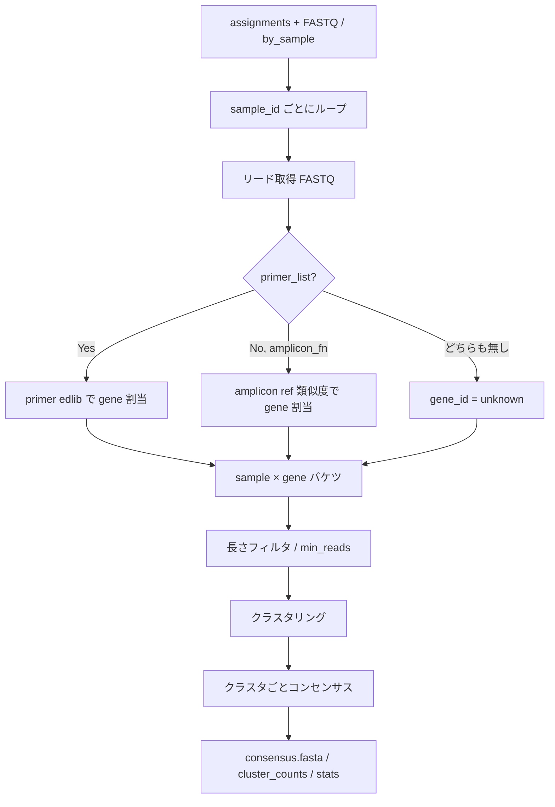

# doAmpliconResolve 実装計画（ref-aware）

作成日: 2026-07-09  
改訂: 2026-07-09 — **Phase C0 実装・テスト完了**を反映  
関連:
- [cursor_dev/pipeline_revise.md](pipeline_revise.md) — パイプライン全体・§6 Step 2
- [cursor_dev/demux_revise.md](demux_revise.md) — Step 1 入出力契約
- [cursor_dev/code_reorganize_plan.md](code_reorganize_plan.md) — 旧 `doAlign` 配置の参考

対象: 新ファイル `R/amplicon_resolve.R`（`export(doAmpliconResolve)`）

---

## 0. 実装進捗（2026-07-09 時点）

| フェーズ | 状態 | 備考 |
|----------|------|------|
| **Phase C0** | **完了（部分）** | 配線・I/O・完全一致クラスタ。gene 割当は未実装 |
| Phase C1 | 未着手 | ref-aware gene 割当 + 実用クラスタ/コンセンサス |
| Phase C2 | 未着手 | `doAlign` 置換・ドキュメント |
| Phase C3 | 未着手 | 高度化（任意） |

**コミット**: `fa775d85` — `R/amplicon_resolve.R`, `NAMESPACE`, 本計画書

### Phase C0 で実装済み

| 項目 | 状態 |
|------|------|
| `doAmpliconResolve()` export | ✓ |
| サンプル I/O（`by_sample` 優先 + 1 パス FASTQ バケット化） | ✓ |
| 完全一致クラスタ（`method = "exact"`） | ✓ |
| consensus = クラスタ代表（最頻＝完全一致） | ✓ |
| 出力: `consensus.fasta`, `clusters.fasta`, `cluster_counts.tsv`, `stats.tsv`, `summary_by_sample.tsv` | ✓ |
| `samples` 部分実行、`overwrite` ガード | ✓ |
| `stats.tsv` の `skip_reason`（`low_sample_reads` / `no_clusters` / 空） | ✓ |
| `gene_id = "unknown"` 固定（primer 無し時のフォールバック相当） | ✓ |

### Phase C0 で未実装（C1 へ）

| 項目 | 状態 |
|------|------|
| `primer_list` / `amplicon_fn` 引数 | 未追加 |
| primer edlib による gene 割当 | 未実装 |
| greedy / 距離ベースクラスタ | 未実装 |
| `gene_assignments.tsv` | 未出力 |
| `man/doAmpliconResolve.Rd` | 未生成（roxygen は `R/amplicon_resolve.R` に記述済み） |
| サンプル並列（`n_core`） | 予約のみ |

### Phase C0 テスト結果（20k データ）

入力: `demultiplex_20k/assignments.tsv` + `basecall_filt_20k.fq`（10,473 reads / 363 samples）

| 指標 | 結果 |
|------|------|
| リード抽出 | 10,473 / 10,473（assignments と一致） |
| 全サンプル処理時間（1 パス FASTQ） | **~2.3 秒**（修正前 ~126 秒） |
| `min_cluster_reads = 5`（デフォルト） | クラスタ **0 件**（全サンプルで完全一致重複なし） |
| `min_cluster_reads = 1` | 正常に `consensus.fasta` / `cluster_counts.tsv` 生成 |
| `skip_reason` 内訳 | `low_sample_reads` 105、`no_clusters` 258 |

**所見**: ONT 生リード＋完全一致クラスタでは `min_cluster_reads = 5` では実質空出力になる。配線確認には `min_cluster_reads = 1` を使うか、**C1 の距離ベースクラスタが必須**。

---

## 1. 目的

demux 済みリード（`assignments.tsv` + FASTQ / `by_sample`）から、**サンプル単位**に:

1. **遺伝子（アンプリコン）割当**（ref-aware）
2. **クラスタリング**および/または**コンセンサス**
3. 下流 editcall が消費できる代表配列・頻度表の出力

を行う。現行 `doAlign`（全リード × amplicon DB BLAST → 巨大表）を **置換**する。

採用方針（[pipeline_revise.md §6.3](pipeline_revise.md)）:

| 選択肢 | 採用 |
|--------|------|
| A. クラスタリングのみ | 内部ステップとして使用 |
| B. コンセンサスのみ | 内部ステップとして使用 |
| **C. ref-aware** | **本線**: amplicon DB / primer で遺伝子割当後に A/B |

```
[assignments + FASTQ | by_sample]
        ↓  サンプル単位でリード取得
[gene assign: primer edlib (+ 任意 amplicon ref)]
        ↓  sample × gene バケツ
[長さフィルタ → クラスタ → 上位クラスタのコンセンサス]
        ↓
amplicon/{sample_id}/consensus.fasta + cluster_counts.tsv + ...
```

---

## 2. 現行 `doAlign` からの差分

| 旧 `doAlign` | 新 `doAmpliconResolve` |
|--------------|------------------------|
| サンプル非依存（全リード一括 BLAST） | **サンプル単位**処理 |
| 出力はリード単位の巨大 `alignment_list.csv` | **クラスタ/コンセンサス中心**の小表 |
| PAM/edit-site 切り出しまで含む | **遺伝子割当 + 配列再構成のみ**（PAM 判定は Step 3） |
| BLAST 必須 | **edlib primer 本線**（既存 C++ edlib 資産を再利用）。BLAST は任意フォールバック |
| FASTA 前提 | **FASTQ**（quality は将来のコンセンサスで利用可能） |

`doAlign` 内の intact / PAM window ロジックは **editcall 再設計側へ移す**。本関数は「どの遺伝子か」「どんな代表配列か」まで。

---

## 3. 決定事項（本計画で固定）

| 項目 | 決定 |
|------|------|
| 処理方針 | **C. ref-aware** |
| 遺伝子割当の主手段 | **primer pair の edlib アンカー検出**（demux と同じ思想） |
| `amplicon_fn` | **任意の補助 ref**（期待長・向き確認・ref-guided 検証・割当フォールバック） |
| サンプル I/O | `by_sample/*.fq.gz` があれば優先。無ければ `assignments` + 元 FASTQ から抽出 |
| 初期アルゴリズム | **Phase C0**: 遺伝子割当 + 多数決/同一配列集計。**Phase C1**: 簡易クラスタ + spoa系コンセンサス（または R 内多数決 MSA） |
| 外部重量ツール | 初期は **必須依存にしない**（vsearch / isONclust / medaka は後段オプション） |
| `doAlign` | Phase C 完了後に **deprecated → 削除**。当面共存可 |
| PAM / genotype | **本関数のスコープ外**（`doEditcall` 再設計で消費） |

---

## 4. API 契約

### 4.1 公開シグネチャ

**現行（Phase C0 実装）**:

```r
doAmpliconResolve <- function(
  assignments,
  out_dir,
  fastq = NULL,
  sample_fastq_dir = NULL,
  method = c("both", "cluster", "consensus"),
  min_reads = 5L,
  min_cluster_reads = 5L,
  samples = NULL,
  n_core = 1L,          # 予約（未使用）
  overwrite = FALSE
)
```

**目標（Phase C1 以降で追加予定）**:

```r
  primer_list = NULL,          # CSV: primer_id, seq（_F/_R）
  amplicon_fn = NULL,          # prepAmpliconDB の amplicon.fa
  max_clusters = 20,
  max_primer_edit = 3,
  end_window = 80,
  length_tolerance = 0.25,
```

### 4.2 引数ルール

| 条件 | 挙動 |
|------|------|
| `sample_fastq_dir` ありかつ該当 `.fq(.gz)` 存在 | それを読む |
| 無し | `fastq` + `assignments` からサンプル単位抽出（内部または一時 `by_sample`） |
| `primer_list` あり | **マルチ gene 割当 ON**（本線） |
| `primer_list` 無し・`amplicon_fn` あり | amplicon 配列へのグローバル類似度で gene 割当（フォールバック） |
| 둘とも無し | gene を `unknown` として 1 バケツでクラスタ/コンセンサス（単一 gene 実験向け） |
| `method = "cluster"` | クラスタ代表のみ（コンセンサス計算スキップまたは代表=最頻配列） |
| `method = "consensus"` | ほぼ 1 クラスタ扱い（または全リードから 1 本の合意配列） |
| `method = "both"` | クラスタ + 各クラスタ合意（**推奨デフォルト**） |

### 4.3 戻り値

**現行（Phase C0）**:

```r
list(
  samples = character(),   # 処理対象 sample_id（assignments から抽出）
  out_dir = character(1),
  table   = data.frame()   # 全 sample の cluster_counts 縦結合（seq 列含む）
)
```

**目標（C1 以降）**: `gene_assignments` を追加。`pipeline_revise.md` §11 と整合。

---

## 5. 入出力ディレクトリ

### 5.1 入力（Step 1 から）

```
demultiplex/
  assignments.tsv          # 必須（または data.frame）
  by_sample/{sample_id}.fq.gz   # 任意だが推奨
```

`assignments.tsv` 必須列: `read_id`, `sample_id`  
（他列は無視してよい。`source_file` は複数 FASTQ 抽出時に利用可）

### 5.2 出力（本 Step）

```
amplicon/
  summary_by_sample.tsv           # 全サンプル横断サマリ
  gene_assignments.tsv            # 任意・診断: read_id, sample_id, gene_id, strand, ...
  {sample_id}/
    consensus.fasta               # >{gene_id}|{cluster_id} または >{gene_id}
    clusters.fasta                # クラスタ代表配列（任意だが both では書く）
    cluster_counts.tsv
    stats.tsv
    reads_by_gene/                # 任意・デバッグ: 中間 FASTQ（デフォルト OFF）
```

### 5.3 `cluster_counts.tsv`

```tsv
sample_id
gene_id
cluster_id
n_reads
fraction          # gene 内割合
fraction_sample   # sample 内割合
n_reads_gene
method            # majority|spoa|...
```

### 5.4 `stats.tsv`（サンプルごと）

```tsv
sample_id
n_reads_in
n_reads_assigned_gene
n_reads_unassigned_gene
n_genes_detected
n_clusters_total
n_skipped_low_count     # min_reads 未満のとき 1、それ以外 0
skip_reason             # low_sample_reads | no_clusters | （空=成功）
```

`summary_by_sample.tsv` にも `skip_reason` を出力（C0 実装済み）。

`elapsed_sec` は C1 以降で追加予定。

### 5.5 `consensus.fasta` / `clusters.fasta` ヘッダ

```
>{gene_id}|cluster_{k};size={n};sample={sample_id}
```

下流 editcall が `gene_id` をパースできるよう、`|` 区切りを固定する。

---

## 6. 処理パイプライン（詳細）



### 6.1 サンプル単位リード取得

優先順（**C0 実装済み** — `.resolve_all_sample_sequences()`）:

1. `sample_fastq_dir/{sample_id}.fq.gz`（または `.fq`）があれば個別読込
2. 無いサンプルは **1 回の FASTQ パス**で `read_id → sample_id` バケット化（`.bucket_sequences_from_fastq()`）
3. `n_reads_in < min_reads` なら `stats` のみ書き `skip_reason = "low_sample_reads"` でスキップ

性能（20k 実測）:

| 経路 | 363 サンプル |
|------|-------------|
| assignments + fastq（1 パス） | ~2.3 秒 |
| by_sample 個別読込 | ~0.04 秒 / 2 サンプル |

メモリ: C0 では全サンプル分の配列を一度にメモリ保持（10k reads 規模では問題なし）。大規模時はサンプル逐次化を検討。

### 6.2 遺伝子割当（ref-aware 本線）

demux と同様、**固定 primer は位置・向きのアンカー、遺伝子 ID は primer ペア同一性で決める**。

#### 6.2.1 primer パース

`primer_list`（現行 `inst/extdata/amplicon_primers.csv` 互換）:

```
DTH7_F,<seq>
DTH7_R,<seq>
...
```

- `_F` / `_R` を剥がした stem を `gene_id` とする
- F/R が揃わない gene はエラー（設計チェック表に書く）

#### 6.2.2 探索ロジック（リードごと）

demux の end-window 思想を再利用:

```
両端 window（end_window bp）で:
  F primer / R primer / それぞれの RC を edlib（max_primer_edit）

採択ルール（提案・プロトタイプ固定）:
  1. F と R が「反対端」に見え、向きが整合するペアが唯一 → その gene_id
  2. 複数 gene が同点 → unassigned_gene（ambiguous）
  3. 片端のみ → 弱割当は初期 OFF（strict）。オプションで later rescue
  4. どちらも見つからない → unassigned_gene
```

向き:

| F hit 端 | R hit 端 | orientation |
|----------|----------|-------------|
| 5' 近傍  | 3' 近傍  | forward（native） |
| R が 5', F が 3'（または RC ヒット） | | reverse → コンセンサス前に RC して揃える |

実装場所の候補:

| 案 | 内容 | 推奨 |
|----|------|------|
| A | R から edlib::（パッケージ未 dependency） | 依存追加が必要なら避ける |
| B | 既存 C++ edlib を薄い `edlib_align` Rcpp で汎用公開 | **推奨**（demux と共有） |
| C | BLAST short（旧 doAlign） | フォールバックのみ |

**推奨 B**: `src/` に汎用 `edlibNeedlemanWunsch` / `edlibFindBest` を demux から切り出し、primer 検索でも barcode 検索でも使えるようにする。demux のホットパスは変更最小で共有化する。

#### 6.2.3 `amplicon_fn` の役割

必須ではない。ある場合:

1. **expected length**: gene ごとの幅を知り、長さフィルタに使う
2. **割当フォールバック**: primer 失敗リードに対し、リード中央 vs amplicon の粗い類似度（edlib / 短 BLAST）で再試行
3. **コンセンサス検証**: 合意配列と ref の差異レポート（診断列）
4. **単一 gene 確認**: primer 無しでも gene_id = FASTA ヘッダ名で割当可能

`prepAmpliconDB()` の出力 `ref/amplicon.fa` をそのまま渡せることを保証する。

### 6.3 リード正規化（クラスタ前）

遺伝子割当成功リードについて:

1. 向きを forward に揃える（RC）
2. （任意 Phase C1+）primer 外側の index 残骸を trim — demux で既にサンプル特定済みなので、**厳密 trim は必須ではない**が、クラスタ品質向上に有効
3. 長さフィルタ: `amplicon_fn` があるとき `expected_len * (1 ± length_tolerance)`  
   - 無いときはサンプル×gene の中央値 ±tolerance、またはスキップ

### 6.4 クラスタリング

#### Phase C0（最初に通す）

- **完全一致（同一配列）集計** = trivial clustering  
- 旧 `doEditcall` の `table(read_seq)` に近い振る舞い
- ONT エラーで過剰分裂するが、**契約・配線の検証**には十分

#### Phase C1（本命プロトタイプ）

依存を増やさず現実的な候補:

| 手法 | 長所 | 短所 |
|------|------|------|
| **距離閾値 OTU 風（edlib / Hamming on k-mer）** | 外部依存なし | 実装とチューニングが必要 |
| **vsearch --cluster_fast**（SystemRequirements） | 実績・速い | 外部バイナリ |
| isONclust | ONT 向き | 依存・導入が重い |

**初期採用案**: Phase C0 → すぐ Phase C1 で **簡易 greedy クラスタ**（ソートしたリードに対し、代表との edlib 距離 ≤ `max_cluster_edit` または相対閾値）。阈值が足りなければオプションで `cluster_backend = c("internal", "vsearch")`。

クラスタ ID: `gene` 内で size 降順に `1..K`（`max_clusters` で打ち切り。余りは `other` にまとめるか捨てる——初期は **捨てて stats に記録**）。

### 6.5 コンセンサス

#### Phase C0

- クラスタ内 **最頻配列**（majority exact）を consensus とする

#### Phase C1

| 手法 | 推奨時期 |
|------|----------|
| 多数決（位置ごと、簡易アライン後） | C1 デフォルト |
| **spoa**（外部 or 後で Rcpp ラップ） | C1b |
| DECIPHER::ConsensusSequence | Bioc 依存が増えるなら慎重 |
| medaka | 精度は高いが重量・Python 依存 → **対象外（ユーザー任意後処理）** |

**初期採用案**: クラスタ代表に全メンバーを pairwise（または spoa）アライン → 各カラム多数決。quality 利用は Phase C2。

`method` との対応:

| method | 挙動 |
|--------|------|
| `cluster` | `clusters.fasta` + counts。`consensus.fasta` = 代表のコピーでも可 |
| `consensus` | 遺伝子ごとに全リードを 1 クラスタ扱い、1 本の consensus |
| `both` | 上位クラスタ各々に consensus |

---

## 7. 内部関数設計

新規ファイル: `R/amplicon_resolve.R`

**実装済み（C0）**:

```
doAmpliconResolve()                 # export
.make_amplicon_stats()              # stats.tsv 生成
.resolve_all_sample_sequences()     # by_sample 優先 + 1 パス FASTQ
.read_sample_fastq_if_present()
.bucket_sequences_from_fastq()
.read_all_sequences_from_fastq()
```

`.as_assignment_df()` は `R/demultiplex.R` の内部関数を再利用。

**C1 で追加予定**:

```
.parse_primer_pairs()               # primer_list → gene_id, F, R
.assign_genes_by_primers()          # edlib primer → gene_id + strand
.assign_genes_by_amplicon_ref()     # フォールバック
.filter_by_length()
.cluster_reads()                    # backend 切替
.consensus_from_cluster()
```

C++（任意だが推奨）:

```
src/edlib_utils.cpp（または demux から切り出し）
  find_best_edlib(query, target, max_edit, mode)
  # primer 検索用に demux AnchorHit 類似の汎用 API
```

テスト用補助（package 外でも可）:

```
cursor_dev/tool_test/.../run_amplicon_resolve.R
```

---

## 8. `doAlign` / editcall との境界

```
旧:
  doDemultiplex(BLAST) ─┐
  doAlign(BLAST)        ├─ join → doEditcall（リード単位 genotype）
                        │

新:
  doDemultiplex(edlib) → assignments
       ↓
  doAmpliconResolve(ref-aware) → consensus / cluster_counts
       ↓
  doEditcall（再設計）→ sample × gene の genotype summary
```

| 責務 | 誰が持つか |
|------|------------|
| sample 割当 | demux |
| gene 割当 | **amplicon resolve** |
| 代表配列 | **amplicon resolve** |
| PAM 窓・intact・indel 分類 | editcall（後続） |
| amplicon.fa 生成 | `prepAmpliconDB`（継続） |

旧 `doAlign` が返していた `read_seq`（cut site 周辺）は、新 editcall が **consensus を ref/PAM に再アライン**して再計算する。resolve 段階では full-amplicon（または primer 間）配列でよい。

---

## 9. 並列・性能

| 規模感 | 方針 |
|--------|------|
| サンプル数 〜384 | **サンプル並列**（`parallel::mclapply` / 将来の future） |
| リード数/サンプル | ストリーム読込。gene 割当はリード並列も可だが、まずサンプル並列のみ |
| edlib 呼び出し | primer 数 × 2（F/R）× 2（RC）× 両端。gene 数が ~10 なら demux より軽い |
| I/O | 診断 `reads_by_gene` はデフォルト OFF |

**実測（C0, 20k reads, 363 samples, 1 パス FASTQ）**: ~2.3 秒（gene 割当・クラスタなしの配線のみ）。gene 割当追加後も数分以内が目標。

---

## 10. 実装フェーズ

### Phase C0 — 配線と契約（最短で動く） ✅ 完了（2026-07-09）

- [x] `R/amplicon_resolve.R` スケルトン + NAMESPACE export
- [x] サンプル FASTQ 解決（by_sample 優先 + 1 パス FASTQ バケット化）
- [x] Phase C0 クラスタ = 同一配列集計（`method = "exact"`）、consensus = 代表配列
- [x] 出力ファイル契約（`skip_reason` 含む `stats.tsv`）
- [x] 20k demux 済みデータで全サンプル + 部分サンプル smoke test
- [ ] primer edlib gene 割当 → **C1 に繰り下げ**

**完了条件（配線）**: 達成。`min_cluster_reads = 1` で `cluster_counts.tsv` / `consensus.fasta` 生成を確認。

**未達（意図的）**: gene_id が primer stem と一致する検証は C1 で実施。

### Phase C1 — ref-aware gene 割当 + 実用クラスタ/コンセンサス ← **次のステップ**

- [ ] C++ 汎用 edlib API 切り出し（`src/edlib_utils.cpp`）
- [ ] `primer_list` 引数 + `.parse_primer_pairs()` + `.assign_genes_by_primers()`
- [ ] sample × gene バケツ化（`unknown` フォールバック維持）
- [ ] greedy / 内部距離クラスタ（`max_cluster_edit`）
- [ ] 簡易 MSA 多数決 or spoa コンセンサス
- [ ] `amplicon_fn` 長さフィルタ・フォールバック割当
- [ ] `gene_assignments.tsv` 出力
- [ ] API 引数拡張（`primer_list`, `amplicon_fn`, `max_clusters`, `max_primer_edit`, `end_window`, `length_tolerance`）
- [ ] `min_reads` / `max_clusters` / `min_cluster_reads` の既定値チューニング
- [ ] `man/doAmpliconResolve.Rd` 生成

### Phase C2 — 置換と整理

- [ ] フルラン（実験データ全体）でカバレッジ確認
- [ ] `doAlign` deprecated 注記
- [ ] README / pipeline 例を `doAmpliconResolve` に更新
- [ ] editcall 再設計（Phase D）の入力アダプタを用意

### Phase C3（任意）— 高度化

- [ ] quality-aware consensus
- [ ] `cluster_backend = "vsearch"`
- [ ] primer 片端 rescue
- [ ] index/primer 厳密 end-trim

---

## 11. テスト計画

### 11.1 ユニット

| テスト | 内容 |
|--------|------|
| primer パース | `_F/_R` ペア、欠落でエラー |
| gene 割当 | 合成リード（known primer 埋め込み）で gene_id・strand 正解 |
| ambiguous | 2 gene 同点 → unassigned |
| 長さフィルタ | expected ±tolerance 外を除外 |
| 出力スキーマ | 列名・FASTA ヘッダ規約 |

### 11.2 統合（実データ）

**C0 実施済み**（`demultiplex_20k` + `basecall_filt_20k.fq`）:

| 確認項目 | 結果 |
|----------|------|
| リード抽出数 = assignments 数 | ✓ |
| `min_reads` 未満サンプルのスキップ | ✓（105 サンプル） |
| `overwrite` ガード | ✓ |
| `by_sample` 経路 | ✓ |
| 出力スキーマ・FASTA ヘッダ | ✓ |
| `min_cluster_reads=5` でクラスタ生成 | ✗（ONT 完全一致重複なし → 想定内） |

**C1 で追加確認**:

1. サンプルあたり検出 gene 数が実験デザインとおおむね一致
2. 旧 `doAlign` の `target_gene` 分布と粗く相関
3. 距離ベースクラスタで `min_cluster_reads=5` が実用的に機能

### 11.3 回帰用成果物

```
cursor_dev/tool_test/miao20250812/amplicon_20k_c0_fixed/   # C0 全サンプル出力（クラスタ 0）
cursor_dev/tool_test/miao20250812/amplicon_20k_c0_fixed_mc1/  # min_cluster_reads=1
```

`run_amplicon_resolve.R` / `amplicon_test_results.md` は C1 着手時に整備予定。

---

## 12. パッケージ影響

| ファイル | 状態 |
|----------|------|
| `R/amplicon_resolve.R` | **追加済み**（C0） |
| `NAMESPACE` | `export(doAmpliconResolve)` **追加済み** |
| `man/doAmpliconResolve.Rd` | 未生成（C1 で `devtools::document()`） |
| `src/*` | C1: 汎用 edlib API 切り出し予定 |
| `R/amplicon_assign.R` | 当面維持、C2 で deprecated |
| `DESCRIPTION` | 変更なし |
| `pipeline_revise.md` | Phase C チェック更新は C1 完了時 |

SystemRequirements に vsearch 等を書くのは `cluster_backend` 導入時のみ。

---

## 13. 未決・意図的延期

本計画で **後回し**するもの:

| 項目 | 扱い |
|------|------|
| medaka / isONclust | 非採用（ユーザー後処理） |
| quality-aware consensus | Phase C2+ |
| 片端 primer rescue | 初期 OFF |
| editcall 本体 | Phase D |
| `doAlign` 即削除 | しない（C2 で deprecated） |

本計画で **プロトタイプ既定として置く**が、計測後に変えうるもの:

| パラメータ | 初期値 | 調整トリガ |
|------------|--------|------------|
| `max_primer_edit` | 3 | 未割当 gene が多い / 誤割当 |
| `end_window` | 80 | primer が窓外 |
| `min_reads` | 5 | 旧 editcall の `count > 4` に合わせた |
| `max_cluster_edit` | TBD（C1） | 過剰分裂 / 過剰結合 |
| `length_tolerance` | 0.25 | chimeric / 断片 |

---

## 14. 成功基準

1. demux 出力だけを入力に、R から `doAmpliconResolve` が通る（basecall / BLAST demux 不要）
2. 出力が §5 のディレクトリ・表契約を満たす
3. マルチ gene（`primer_list`）で sample × gene バケツが得られる
4. 単一 gene / primer 無しでも `unknown` バケツで落ちない
5. 下流が `consensus.fasta` + `cluster_counts.tsv` だけ見て gene ごとの代表配列を扱える
6. 旧「全リード BLAST → join」への依存なしに Step 2 が完結する

---

## 15. 次のステップ（Phase C1 着手順）

C0 で配線は通った。**実用化には C1 が必須**（現状は ONT 生リード＋完全一致ではクラスタが成立しない）。

### 推奨着手順

1. **C++ 汎用 edlib API** — demux の `AnchorHit` ロジックを `src/edlib_utils.cpp` に切り出し、primer 検索で再利用
2. **`primer_list` 引数追加** — `.parse_primer_pairs()` で `inst/extdata/amplicon_primers.csv` 互換パース
3. **gene 割当** — `.assign_genes_by_primers()`（両端 window + edlib + 向き判定）→ `gene_assignments.tsv`
4. **sample × gene バケット** — 現行 `unknown` 固定を置換。未割当は `skip_reason` に反映
5. **greedy クラスタ** — edlib 距離 ≤ `max_cluster_edit` で ONT エラーを許容
6. **コンセンサス** — クラスタ内多数決（位置ごと）
7. **合成リード単体テスト** → **20k 実データ**で gene 分布・クラスタ数を確認
8. **`devtools::document()`** + README 例更新

### C1 完了の判定基準

- `primer_list` 指定時、各サンプルで複数 `gene_id` が検出される
- `min_cluster_reads = 5` で有意なクラスタが得られる（距離ベース）
- 旧 `doAlign` の `target_gene` 分布と粗く相関
- editcall 再設計（Phase D）への入力として `consensus.fasta` + `cluster_counts.tsv` が使える

---

## 16. 参考: 旧経路との対応表

| 旧成果物 | 新成果物 |
|----------|----------|
| `alignment_list.csv` の `target_gene` | `gene_assignments.tsv` / `cluster_counts$gene_id` |
| リード単位 `read_seq`（cut site） | （延期）editcall が consensus から再計算 |
| `intact_seq.fa` | editcall 側、または `prepAmpliconDB` + PAM から別途 |
| サンプル横断巨大表 | `amplicon/{sample_id}/` 分割 + 任意の縦結合 `table` |
