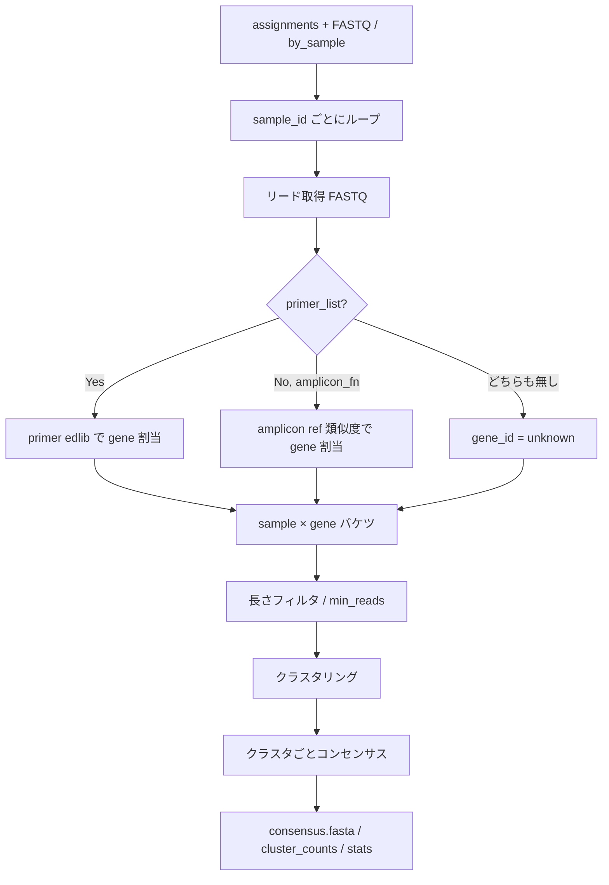

# doAssignGenes / doAssembleAmplicons 実装計画（ref-aware）

作成日: 2026-07-09  
改訂:

- 2026-07-09 — Phase C0 実装・テスト完了を反映
- 2026-07-09 — **Phase C1 実装完了**、`min_reads` を sample×gene 適用に更新
- 2026-07-09 — **Phase C2**: `doAlign` deprecated、README / pipeline 更新、フルラン確認
- 2026-07-09 — **Phase C3**: quality / spoa / strict_end_trim + 20k ablation
- 2026-07-09 — **Phase B 完了**: `miaoEditcall` / `doAlign` / `doBasecall` / BLAST 削除。`prepAmpliconDB` を `matchPattern` 実装に置換
- 2026-07-14 — `fraction_sample` 定義を訂正（sample×gene バケツ内比率）。コンセンサスは spoa 固定（majority/quality 廃止）。詳細は [pipeline_revise.md](pipeline_revise.md) §6.3 / §17
- 2026-07-16 — **Phase K 同期**: 正式は `vsearch` + `abpoa`（spoa/internal/mmseqs クラスタ廃止）。`min_cluster_identity=0.95`、`max_clusters=Inf`、`fraction_bucket`（旧 fraction_sample）、`clusters.fasta`=メンバー配列。詳細は [pipeline_revise.md](pipeline_revise.md) §6 / §19
関連:
- [cursor_dev/pipeline_revise.md](pipeline_revise.md) — パイプライン全体・§6 Step 2
- [cursor_dev/demux_revise.md](demux_revise.md) — Step 1 入出力契約
- [cursor_dev/code_reorganize_plan.md](code_reorganize_plan.md) — 旧 `doAlign` 配置の参考

対象: `doAssignGenes` + `doAssembleAmplicons`（Step 2）+ `doEditcall`（Step 3）。C0–D 完了。

---

## 0. 実装進捗サマリ（2026-07-16 時点）

**結論:** Step 1–3 本線は **実装完了**。Phase B でレガシー削除済み。**Assemble 正式構成は Phase K: `vsearch` + `abpoa`**（下記 0.2）。歴史的 C3 ablation（vsearch+spoa）は参考値。

### 0.1 フェーズ一覧

| フェーズ | 状態 | 備考 |
| -------- | ---- | ---- |
| Phase C0 | **完了** | 配線・I/O・完全一致クラスタ |
| Phase C1 | **完了** | primer gene 割当 + greedy クラスタ + 多数決コンセンサス |
| Phase C2 | **完了** | `doAlign` deprecated、README 更新、フルラン確認 |
| Phase C3 | **完了** | （歴史）quality / spoa / vsearch；ablation 済み |
| **Phase B** | **完了** | レガシー削除 + `prepAmpliconDB` を `matchPattern` 化（BLAST 不要） |
| **Phase K** | **完了** | vsearch + abpoa；`min_cluster_identity` / `fraction_bucket` 等（pipeline_revise §19） |

### 0.2 推奨エンドツーエンドフロー（現行）

```
[ユーザー] Dorado 等で basecall → FASTQ
    ↓
doDemultiplex(fastq, index_list, ...)     → demultiplex/assignments.tsv
    ↓ 任意
splitDemultiplexReads(...)                → demultiplex/by_sample/*.fq.gz
    ↓
doAssignGenes(...)                        → gene_assignments.tsv
    ↓
doAssembleAmplicons(                      → amplicon/{sample_id}/consensus.fasta
  cluster_backend = "vsearch",               clusters.fasta（メンバー）,
  min_cluster_identity = 0.95,               cluster_counts.tsv, ...
  max_clusters = Inf
)
    ↓ 任意
doEditcall(gene_assign = …, ...)          → editcall/（経路 B・Assemble 非依存）
```

**正式バックエンド（Phase K）:** `cluster_backend = "vsearch"` + **abpoa**（PATH 要）。旧 spoa / internal は廃止。

### 0.3 削除済み（Phase B）

| コンポーネント | 扱い |
| -------------- | ---- |
| `miaoEditcall()` | **削除** |
| `doAlign()` | **削除** |
| `doBasecall()` / `makeMMI()` | **削除** |
| `R/blast_utils.R` | **削除** |
| `doEditcall(demult_out, align_out)` | **削除**（`amplicon_out` のみ） |

### 0.4 残タスク

| 項目 | 優先度 | 備考 |
| ---- | ------ | ---- |
| ~~`evalMiao` / `editViewer` 更新~~ | 完了 | `demultiplex/` + `amplicon/` + `editcall/` を集計 |
| resolve サンプル並列 | 低 | `n_core` は現状 C++ OpenMP のみ |
| vsearch `id` 閾値チューニング | 任意 | full で modest gain |

### 0.5 Phase C1 実装済み機能

| 項目 | 状態 |
| ---- | ---- |
| `src/amplicon_core.cpp`（primer / trim / greedy / consensus） | ✓ |
| `primer_list` / `amplicon_fn` | ✓ |
| sample × gene バケツ + 向き補正 + primer 間 trim | ✓ |
| greedy クラスタ + majority consensus | ✓ |
| `gene_assignments.tsv` / `man/doAssignGenes.Rd` | ✓ |
| `min_reads` を sample×gene に独立適用 | ✓ |
| C3: vsearch / spoa / quality / strict_end_trim | ✓ |
| Phase D: `doEditcall(amplicon_out)` | ✓ |
| サンプル並列（resolve） | 未実装 |

### 0.6 `min_reads` の契約（確定）

| 項目 | 決定 |
| ---- | ---- |
| 適用単位 | **sample × gene バケツ**（各 gene に同じ閾値） |
| アダプティブ学習 | **しない** |
| gene 空間 | ユーザーが `primer_list` で渡す |
| サンプル早期スキップ | `n_reads == 0`（`empty_sample`）のみ |
| `skip_reason` | `low_gene_reads` = 全 gene が `min_reads` 未満 |

### 0.7 テスト実績（参照）

**C1 / 20k:** gene 割当 ~88%、637 clusters / 161 samples、~8–10 秒（363 samples）

**C3 ablation:** vsearch+spoa が最高精度（20k: ref_agree 0.923）— 詳細は §10

**Phase D / full:** 386 samples、~137 秒、4,339 alleles、8 gene 検出 — 詳細は §10 Phase D

---


## 1. 目的

demux 済みリード（`assignments.tsv` + FASTQ / `by_sample`）から、**サンプル単位**に:

1. **遺伝子（アンプリコン）割当**（ref-aware）
2. **クラスタリング**および/または**コンセンサス**
3. 下流 editcall が消費できる代表配列・頻度表の出力

を行う。旧 `doAlign`（全リード × amplicon DB BLAST → 巨大表）および `miaoEditcall()` 一括ラッパーを **置換済み**（後者はコード残存・不要）。

採用方針（[pipeline_revise.md §6.3](pipeline_revise.md)）:


| 選択肢              | 採用                                        |
| ---------------- | ----------------------------------------- |
| A. クラスタリングのみ     | 内部ステップとして使用                               |
| B. コンセンサスのみ      | 内部ステップとして使用                               |
| **C. ref-aware** | **本線**: amplicon DB / primer で遺伝子割当後に A/B |


```
[assignments + FASTQ | by_sample]
        ↓  サンプル単位でリード取得
[gene assign: primer edlib (+ 任意 amplicon ref)]
        ↓  sample × gene バケツ
[長さフィルタ → クラスタ → 上位クラスタのコンセンサス]
        ↓
amplicon/{sample_id}/consensus.fasta + cluster_counts.tsv + ...
```

---


## 2. 現行 `doAlign` からの差分


| 旧 `doAlign`                      | 新 `doAssignGenes` + `doAssembleAmplicons`                |
| -------------------------------- | --------------------------------------------------------- |
| サンプル非依存（全リード一括 BLAST）            | **サンプル単位**処理                                              |
| 出力はリード単位の巨大 `alignment_list.csv` | **クラスタ/コンセンサス中心**の小表                                      |
| PAM/edit-site 切り出しまで含む           | **遺伝子割当 + 配列再構成のみ**（PAM 判定は Step 3）                       |
| BLAST 必須                         | **edlib primer 本線**（既存 C++ edlib 資産を再利用）。BLAST は任意フォールバック |
| FASTA 前提                         | **FASTQ**（quality は将来のコンセンサスで利用可能）                        |


`doAlign` 内の intact / PAM window ロジックは **editcall 再設計側へ移す**。本関数は「どの遺伝子か」「どんな代表配列か」まで。

---


## 3. 決定事項（本計画で固定）


| 項目             | 決定                                                                    |
| -------------- | --------------------------------------------------------------------- |
| 処理方針           | **C. ref-aware**                                                      |
| 遺伝子割当の主手段      | **primer pair の edlib アンカー検出**（demux と同じ思想）                           |
| `amplicon_fn`  | **任意の補助 ref**（期待長・向き確認・ref-guided 検証・割当フォールバック）                       |
| サンプル I/O       | `by_sample/*.fq.gz` があれば優先。無ければ `assignments` + 元 FASTQ から **1 パス**抽出 |
| クラスタ / コンセンサス  | C1 当時: greedy + majority。**現行推奨:** `vsearch` + **spoa 固定**（majority/quality 廃止; pipeline_revise） |
| `min_reads`    | **sample×gene に同じ閾値を独立適用**。アダプティブ調整はしない                               |
| gene 空間        | ユーザーが `primer_list` で渡す（実験ごとに変えてよい）                                   |
| 外部ツール        | vsearch / spoa は **オプション**（推奨バックエンド）。isONclust / medaka は非採用               |
| `doAlign`      | **deprecated**（削除は後続）                                        |
| `miaoEditcall` | **不要**（廃止予定。各 `do*` を明示呼び出し）                              |
| PAM / genotype | **resolve スコープ外** — `doEditcall()` が `amplicon/` を消費（Phase D 完了）        |


---


## 4. API 契約


### 4.1 公開シグネチャ

**現行（Phase C3 実装）**:

```r
doAssignGenes <- function(
  assignments,
  out_dir,
  fastq = NULL,
  sample_fastq_dir = NULL,
  primer_list = NULL,
  amplicon_fn = NULL,
  ...
)

doAssembleAmplicons <- function(
  gene_assign,
  out_dir,
  primer_list = NULL,
  method = c("both", "cluster", "consensus"),
  min_reads = 5L,
  min_cluster_reads = 5L,
  max_clusters = 20L,
  max_cluster_edit = 12L,
  max_primer_edit = 5L,
  n_core = 1L,                              # OpenMP（trim）
  consensus_backend = c("majority", "spoa", "quality"),
  cluster_backend = c("internal", "vsearch"),
  assembly_backend = c("cluster", "overlap_graph"),
  overlap_min_identity = 0.90,
  strict_end_trim = FALSE,
  overwrite = FALSE
)
```

**推奨（精度優先）:** `cluster_backend = "vsearch"`, `consensus_backend = "spoa"`。


### 4.2 引数ルール


| 条件                                      | 挙動                                                      |
| --------------------------------------- | ------------------------------------------------------- |
| `sample_fastq_dir` ありかつ該当 `.fq(.gz)` 存在 | それを読む                                                   |
| 無し                                      | `fastq` + `assignments` からサンプル単位抽出（内部または一時 `by_sample`） |
| `primer_list` あり                        | **マルチ gene 割当 ON**（本線）                                  |
| `primer_list` 無し・`amplicon_fn` あり       | amplicon 配列へのグローバル類似度で gene 割当（フォールバック）                 |
| 둘とも無し                                   | gene を `unknown` として 1 バケツでクラスタ/コンセンサス（単一 gene 実験向け）    |
| `method = "cluster"`                    | クラスタ代表のみ（コンセンサス計算スキップまたは代表=先頭配列）                        |
| `method = "consensus"`                  | 各クラスタに多数決合意                                             |
| `method = "both"`                       | クラスタ + 各クラスタ合意（**推奨デフォルト**）                             |
| `min_reads`                             | **各 sample×gene バケツ**に同じ値を独立適用                          |


### 4.3 戻り値

**現行（Phase C1+）** — `stats_unassign = TRUE` のとき `stats_unassigned` も返す:

```r
list(
  samples = character(),
  out_dir = character(1),
  table   = data.frame(),         # 全 sample の cluster 縦結合（seq 列含む）
  gene_assignments = data.frame()
)
```

### 4.4 `doEditcall` API（Phase D）

```r
doEditcall(
  amplicon_out,                  # resolve 戻り値 or amplicon/ パス
  pam_list,
  genome_fn,
  amplicon_fn,
  primer_list,
  editcall_dir,
  sample_list = NULL,
  check_window = 10L,
  min_count = 5L
)
```

レガシー互換: `doEditcall(demult_out, align_out, editcall_dir, ...)` も引き続き動作。
詳細: [editcall_adapter.md](editcall_adapter.md)。


## 5. 入出力ディレクトリ


### 5.1 入力（Step 1 から）

```
demultiplex/
  assignments.tsv          # 必須（または data.frame）
  by_sample/{sample_id}.fq.gz   # 任意だが推奨
```

`assignments.tsv` 必須列: `read_id`, `sample_id`  
（他列は無視してよい。`source_file` は複数 FASTQ 抽出時に利用可）

### 5.2 出力（本 Step）

```
amplicon/
  summary_by_sample.tsv
  gene_assignments.tsv
  {sample_id}/
    consensus.fasta
    clusters.fasta
    cluster_counts.tsv
    stats.tsv

editcall/                         # Step 3（Phase D）
  editcall_all.csv
  editcall_filtered.csv
  editcall_summary.csv
  intact_seq.fa
```


### 5.3 `cluster_counts.tsv`

```tsv
sample_id
gene_id
cluster_id
n_reads
fraction          # gene 内割合（クラスタ通過後）
fraction_bucket   # **sample×gene バケツ内比率**（旧名 fraction_sample。サンプル全体の demux リード比ではない。pipeline_revise §6.3）
n_reads_gene
method            # spoa|...（majority/quality は廃止・spoa 固定）
```


### 5.4 `stats.tsv`（サンプルごと）

```tsv
sample_id
n_reads_in
n_reads_assigned_gene
n_reads_unassigned_gene
n_genes_detected
n_clusters_total
n_skipped_low_count     # min_reads 未満で落とした gene 数
skip_reason             # 空=成功 | empty_sample | no_gene_assigned | low_gene_reads | no_clusters
```

`summary_by_sample.tsv` にも `skip_reason` / `n_genes` を出力。

### 5.5 `consensus.fasta` / `clusters.fasta` ヘッダ

```
>{gene_id}|cluster_{k};size={n};sample={sample_id}
```

下流 editcall が `gene_id` をパースできるよう、`|` 区切りを固定する。

---


## 6. 処理パイプライン（詳細）




### 6.1 サンプル単位リード取得

優先順（**C0 実装済み** — `.resolve_all_sample_sequences()`）:

1. `sample_fastq_dir/{sample_id}.fq.gz`（または `.fq`）があれば個別読込
2. 無いサンプルは **1 回の FASTQ パス**で `read_id → sample_id` バケット化（`.bucket_sequences_from_fastq()`）
3. `n_reads_in < min_reads` なら `stats` のみ書き `skip_reason = "low_sample_reads"` でスキップ

性能（20k 実測）:


| 経路                        | 363 サンプル         |
| ------------------------- | ---------------- |
| assignments + fastq（1 パス） | ~2.3 秒           |
| by_sample 個別読込            | ~0.04 秒 / 2 サンプル |


メモリ: C0 では全サンプル分の配列を一度にメモリ保持（10k reads 規模では問題なし）。大規模時はサンプル逐次化を検討。

### 6.2 遺伝子割当（ref-aware 本線）

demux と同様、**固定 primer は位置・向きのアンカー、遺伝子 ID は primer ペア同一性で決める**。

#### 6.2.1 primer パース

`primer_list`（現行 `inst/extdata/amplicon_primers.csv` 互換）:

```
DTH7_F,<seq>
DTH7_R,<seq>
...
```

- `_F` / `_R` を剥がした stem を `gene_id` とする
- F/R が揃わない gene はエラー（設計チェック表に書く）


#### 6.2.2 探索ロジック（リードごと）

demux の end-window 思想を再利用:

```
両端 window（end_window bp）で:
  F primer / R primer / それぞれの RC を edlib（max_primer_edit）

採択ルール（提案・プロトタイプ固定）:
  1. F と R が「反対端」に見え、向きが整合するペアが唯一 → その gene_id
  2. 複数 gene が同点 → unassigned_gene（ambiguous）
  3. 片端のみ → 弱割当は初期 OFF（strict）。オプションで later rescue
  4. どちらも見つからない → unassigned_gene
```

向き:


| F hit 端                    | R hit 端 | orientation                 |
| -------------------------- | ------- | --------------------------- |
| 5' 近傍                      | 3' 近傍   | forward（native）             |
| R が 5', F が 3'（または RC ヒット） |         | reverse → コンセンサス前に RC して揃える |


実装場所の候補:


| 案   | 内容                                        | 推奨                |
| --- | ----------------------------------------- | ----------------- |
| A   | R から edlib::（パッケージ未 dependency）           | 依存追加が必要なら避ける      |
| B   | 既存 C++ edlib を薄い `edlib_align` Rcpp で汎用公開 | **推奨**（demux と共有） |
| C   | BLAST short（旧 doAlign）                    | フォールバックのみ         |


**推奨 B**: `src/` に汎用 `edlibNeedlemanWunsch` / `edlibFindBest` を demux から切り出し、primer 検索でも barcode 検索でも使えるようにする。demux のホットパスは変更最小で共有化する。

#### 6.2.3 `amplicon_fn` の役割

必須ではない。ある場合:

1. **expected length**: gene ごとの幅を知り、長さフィルタに使う
2. **割当フォールバック**: primer 失敗リードに対し、リード中央 vs amplicon の粗い類似度（edlib / 短 BLAST）で再試行
3. **コンセンサス検証**: 合意配列と ref の差異レポート（診断列）
4. **単一 gene 確認**: primer 無しでも gene_id = FASTA ヘッダ名で割当可能

`prepAmpliconDB()` の出力 `ref/amplicon.fa` をそのまま渡せることを保証する。

### 6.3 リード正規化（クラスタ前）

遺伝子割当成功リードについて:

1. 向きを forward に揃える（RC）
2. （任意 Phase C1+）primer 外側の index 残骸を trim — demux で既にサンプル特定済みなので、**厳密 trim は必須ではない**が、クラスタ品質向上に有効
3. 長さフィルタ: `amplicon_fn` があるとき `expected_len * (1 ± length_tolerance)`
  - 無いときはサンプル×gene の中央値 ±tolerance、またはスキップ


### 6.4 クラスタリング


#### Phase C0（最初に通す）

- **完全一致（同一配列）集計** = trivial clustering  
- 旧 `doEditcall` の `table(read_seq)` に近い振る舞い
- ONT エラーで過剰分裂するが、**契約・配線の検証**には十分


#### Phase C1（本命プロトタイプ）

依存を増やさず現実的な候補:


| 手法                                             | 長所     | 短所           |
| ---------------------------------------------- | ------ | ------------ |
| **距離閾値 OTU 風（edlib / Hamming on k-mer）**       | 外部依存なし | 実装とチューニングが必要 |
| **vsearch --cluster_fast**（SystemRequirements） | 実績・速い  | 外部バイナリ       |
| isONclust                                      | ONT 向き | 依存・導入が重い     |


**初期採用案**: Phase C0 → すぐ Phase C1 で **簡易 greedy クラスタ**（ソートしたリードに対し、代表との edlib 距離 ≤ `max_cluster_edit` または相対閾値）。阈值が足りなければオプションで `cluster_backend = c("internal", "vsearch")`。

クラスタ ID: `gene` 内で size 降順に `1..K`（`max_clusters` で打ち切り。余りは `other` にまとめるか捨てる——初期は **捨てて stats に記録**）。

### 6.5 コンセンサス


#### Phase C0

- クラスタ内 **最頻配列**（majority exact）を consensus とする


#### Phase C1


| 手法                          | 推奨時期                                    |
| --------------------------- | --------------------------------------- |
| 多数決（位置ごと、簡易アライン後）           | C1 デフォルト                                |
| **spoa**（外部 or 後で Rcpp ラップ） | C1b                                     |
| DECIPHER::ConsensusSequence | Bioc 依存が増えるなら慎重                         |
| medaka                      | 精度は高いが重量・Python 依存 → **対象外（ユーザー任意後処理）** |


**初期採用案**: クラスタ代表に全メンバーを pairwise（または spoa）アライン → 各カラム多数決。quality 利用は Phase C2。

`method` との対応:


| method      | 挙動                                                      |
| ----------- | ------------------------------------------------------- |
| `cluster`   | `clusters.fasta` + counts。`consensus.fasta` = 代表のコピーでも可 |
| `consensus` | 遺伝子ごとに全リードを 1 クラスタ扱い、1 本の consensus                     |
| `both`      | 上位クラスタ各々に consensus                                     |


---


## 7. 内部関数設計

**R（**`R/amplicon_resolve.R`**）**:

```
doAssignGenes()                    # export
doAssembleAmplicons()              # export
.parse_primer_pairs()
.assign_reads_to_genes()
.assign_genes_by_amplicon_ref()
.orient_read_seqs()
.filter_reads_by_expected_length()
.cluster_and_consensus_reads()
.resolve_all_sample_reads()         # by_sample 優先 + 1 パス FASTQ
.bucket_reads_from_fastq()
.make_amplicon_stats() / .make_summary_row() / .write_sample_skip()
```

`.as_assignment_df()` は `R/demultiplex.R` の内部関数を再利用。

**C++（**`src/amplicon_core.cpp`**）**:

```
assign_genes_primers_cpp()          # gene 割当
trim_amplicon_insert_cpp()          # primer 間 insert 抽出
greedy_cluster_cpp()                # 距離ベースクラスタ
consensus_sequences_cpp()           # 多数決コンセンサス
find_primer_hit_cpp() / edlib_edit_distance_cpp()
```

---


## 8. `doAlign` / editcall との境界

```
旧:
  doDemultiplex(BLAST) ─┐
  doAlign(BLAST)        ├─ join → doEditcall（リード単位 genotype）
                        │

新:
  doDemultiplex(edlib) → assignments
       ↓
  doAssignGenes + doAssembleAmplicons(ref-aware) → consensus / cluster_counts
       ↓
  doEditcall(amplicon_out) → editcall_summary.csv
```

**`miaoEditcall()` は上記の代替ではない**（旧 basecall + BLAST align 経路）。新規解析では各ステップを個別に呼ぶ。


| 責務                    | 誰が持つか                |
| --------------------- | -------------------- |
| sample 割当             | demux                |
| gene 割当               | **amplicon resolve** |
| 代表配列                  | **amplicon resolve** |
| PAM 窓・intact・indel 分類 | **editcall**（Phase D 完了）   |
| amplicon.fa 生成        | `prepAmpliconDB`（継続） |


旧 `doAlign` が返していた `read_seq`（cut site 周辺）は、**Phase D の `doEditcall`** が consensus を amplicon insert にアラインして再計算する。

---


## 9. 並列・性能


| 規模感        | 方針                                                     |
| ---------- | ------------------------------------------------------ |
| サンプル数 〜384 | **サンプル並列**（`parallel::mclapply` / 将来の future）          |
| リード数/サンプル  | ストリーム読込。gene 割当はリード並列も可だが、まずサンプル並列のみ                   |
| edlib 呼び出し | primer 数 × 2（F/R）× 2（RC）× 両端。gene 数が ~10 なら demux より軽い |
| I/O        | 診断 `reads_by_gene` はデフォルト OFF                          |


**実測**:

- C0 配線のみ: ~2.3 秒（363 samples）
- C1（primer + cluster）: **~8–10 秒**（363 samples, 20k reads）
- Phase D editcall（vsearch+spoa amplicon, 386 samples）: **~137 秒**（4,339 alleles → 349 samples）

---


## 10. 実装フェーズ


### Phase C0 — 配線と契約 ✅ 完了（2026-07-09）

- [x] `R/amplicon_resolve.R` + NAMESPACE export
- [x] サンプル FASTQ 解決（by_sample 優先 + 1 パス FASTQ）
- [x] 完全一致クラスタ / 出力契約 / 20k smoke test


### Phase C1 — ref-aware gene 割当 + 実用クラスタ ✅ 完了（2026-07-09）

- [x] `src/amplicon_core.cpp`（primer / trim / greedy / consensus）
- [x] `primer_list` + gene 割当 + `gene_assignments.tsv`
- [x] sample × gene バケツ、向き補正、primer 間 trim
- [x] greedy クラスタ + majority consensus
- [x] `amplicon_fn` 長さフィルタ・フォールバック割当
- [x] API 拡張 / 既定値調整（`end_window=150` 等）
- [x] `min_reads` **を sample×gene に同一閾値で独立適用**
- [x] `man/doAssignGenes.Rd`
- [x] `man/doAssembleAmplicons.Rd`


### Phase C2 — 置換と整理 ✅ 完了（2026-07-09）

- [x] フルラン（`demultiplex_full` + 実験 FASTQ）カバレッジ確認 → `amplicon_full_c2/`
- [x] `doAlign` deprecated（`.Deprecated("doAssembleAmplicons")` + Rd）
- [x] README を demux → resolve 推奨フローに更新
- [x] `pipeline_revise.md` Phase C チェック更新
- [x] editcall 入力アダプタ草案（[editcall_adapter.md](editcall_adapter.md)）
- [x] `doEditcall` に transitional 注記（Phase D で本実装に置換）
- [x] 大規模 FASTQ バケット化の性能修正（`rbind` O(n²) → 事前確保バッファ）

### Phase C3 — 高度化 ✅ 完了（2026-07-09）

実装（フラグ付き・既定は C1 維持）:

- [x] quality-aware consensus（`consensus_backend = "quality"`）
- [x] spoa（`consensus_backend = "spoa"`；外部 `spoa` バイナリ）
- [x] index/primer 厳密 end-trim（`strict_end_trim = TRUE`）
- [ ] primer 片端 rescue — **非採用**（精度試験対象外）
- [x] **`cluster_backend = "vsearch"`**（ablation 済み）
- [x] OpenMP `n_core`（gene 割当 / trim；サンプル並列は別件）

20k ablation（primer-trimmed amplicon.fa との一致）: [c3_ablation_results.md](tool_test/miao20250812/c3_ablation_results.md)

| variant | ref_agree_frac (edit≤12) | ref_edit_median | 備考 |
| ------- | ------------------------ | --------------- | ---- |
| baseline (majority) | 0.782 | 4 | C1 既定 |
| quality | 0.749 | 6 | このデータでは baseline より悪化 |
| **spoa** | **0.909** | **2** | 最大改善（20k） |
| **vsearch+spoa** | **0.923** | **2** | 20k 最高；full 0.847（internal+spoa 0.816） |
| vsearch+majority | 0.838 (20k) / 0.579 (full) | — | full では過分裂（10744 clusters） |

推奨: 精度優先なら **`cluster_backend="vsearch"` + `consensus_backend="spoa"`**（両方 PATH 要）。

### Phase D — Editcall 接続 ✅ 完了（2026-07-09）

- [x] `doEditcall(amplicon_out, ...)` 実装（`R/editcall.R`）
- [x] consensus → primer-trimmed insert アライン → PAM 窓 `read_seq` 抽出
- [x] `n_reads` 重み付け集計 + 従来 genotype 分類・`editcall_summary.csv` 互換
- [x] レガシー `demult_out` + `align_out` 経路の互換維持
- [x] フル検証（vsearch+spoa amplicon, 386 samples）→ `editcall_phase_d_vsearch_spoa/`

**Phase D 実測（full, vsearch+spoa upstream）:**

| 指標 | 結果 |
| ---- | ---- |
| 処理時間 | ~137 秒 |
| editcall_all | 4,339 行 |
| editcall_filtered | 2,579 行 |
| サンプル数 | 349 |
| 遺伝子 | 8 gene すべて（DTH7, GW5, LG1, RAE3, RC, SD1, SH4, WX） |
| non-ref genotype | 316 samples |

テストスクリプト:
- `cursor_dev/tool_test/miao20250812/run_editcall_phase_d.R`（フル）
- `cursor_dev/tool_test/miao20250812/run_phase_d_smoke.R`（5 サンプル）

---


## 11. テスト計画


### 11.1 ユニット


| テスト                 | 内容                        | 状態     |
| ------------------- | ------------------------- | ------ |
| primer パース          | `_F/_R` ペア、欠落でエラー         | 実装済み   |
| gene 割当             | 実データで 8 gene 検出           | ✓（20k） |
| 距離クラスタ              | `min_cluster_reads=5` で出力 | ✓      |
| `min_reads` gene 適用 | sample 合計ではなく gene バケツ    | ✓      |
| 出力スキーマ              | 列名・FASTA ヘッダ規約            | ✓      |
| editcall 接続           | consensus → genotype summary | ✓（Phase D） |


### 11.2 統合（実データ）

**C1 実施済み**（`demultiplex_20k` + primers）:

| 確認項目 | 結果 |
| -------- | ---- |
| gene 割当率 ~88% | ✓ |
| 8 gene すべて検出 | ✓ |
| 637 clusters / 161 samples | ✓ |
| 処理時間 < 1 分 | ✓（~8–10 秒） |

**C2 実施済み**（`demultiplex_full` + 実験 FASTQ）: フルラン確認 → `amplicon_full_c2/`, `amplicon_c3_ablation_full/`

**Phase D 実施済み**（`amplicon_c3_ablation_full/vsearch_spoa`）: 上記 §10 Phase D 実測参照。


### 11.3 回帰用成果物

```
cursor_dev/tool_test/miao20250812/
  demultiplex_20k/
  demultiplex_full/
  amplicon_c3_ablation_full/vsearch_spoa/
  editcall_phase_d_vsearch_spoa/
  run_editcall_phase_d.R
  run_phase_d_smoke.R
```

---


## 12. パッケージ影響


| ファイル                          | 状態                                       |
| ----------------------------- | ---------------------------------------- |
| `R/amplicon_resolve.R`        | **C3 実装済み**（vsearch / spoa / quality）     |
| `src/amplicon_core.cpp`       | **追加済み**                                 |
| `R/editcall.R`                | **Phase D 実装済み**（amplicon 入力 + レガシー互換）  |
| `NAMESPACE`                   | `export(doAssignGenes)`, `export(doAssembleAmplicons)`, `export(doEditcall)` |
| `man/doAssignGenes.Rd` / `man/doAssembleAmplicons.Rd` | 生成済み                    |
| `man/doEditcall.Rd`           | Phase D / B で更新                           |
| `README.md`                   | demux → resolve → editcall（BLAST 不要）      |
| `pipeline_revise.md`          | Phase B/D チェック更新済み                     |

`cluster_backend = "vsearch"` / `consensus_backend = "spoa"` 使用時は SystemRequirements にバイナリ記載を検討。

---


## 13. 未決・意図的延期


| 項目                      | 扱い                                  |
| ----------------------- | ----------------------------------- |
| medaka / isONclust      | 非採用（ユーザー後処理）                        |
| quality-aware consensus | C3 実装済み（このデータでは spoa より劣る）          |
| 片端 primer rescue        | 非採用                                   |
| editcall 本体             | **Phase D 完了**                        |
| BLAST 依存                | **Phase B で撤去**（`prepAmpliconDB` 含む） |
| gene / panel 別の閾値学習     | **しない**                              |
| evalMiao / editViewer   | **完了**（新パイプライン出力に対応）               |


現行既定（実測反映済み）:


| パラメータ               | 現行値  | 備考                        |
| ------------------- | ---- | ------------------------- |
| `max_primer_edit`   | 5    | index 内側 primer を拾うため 3→5 |
| `end_window`        | 150  | 同様に 80→150                |
| `min_reads`         | 5    | **sample×gene 単位**        |
| `min_cluster_reads` | 5    | クラスタ単位                    |
| `max_cluster_edit`  | 12   | ONT 生リード距離を許容             |
| `length_tolerance`  | 0.25 | `amplicon_fn` があるときのみ     |


---


## 14. 成功基準


| #   | 基準                                  | 状態        |
| --- | ----------------------------------- | --------- |
| 1   | demux 出力だけで `doAssignGenes` + `doAssembleAmplicons` が通る | ✓ |
| 2   | §5 の出力契約を満たす                        | ✓         |
| 3   | マルチ gene で sample × gene バケツが得られる   | ✓         |
| 4   | primer 無しでも `unknown` バケツで落ちない      | ✓         |
| 5   | 下流が consensus / cluster_counts を使える | ✓         |
| 6   | 旧「全リード BLAST → join」依存なし            | ✓         |
| 7   | `doEditcall` が `amplicon/` を消費できる   | ✓（Phase D） |
| 8   | vsearch + spoa で E2E が通る             | ✓（full 検証） |


---


## 15. 残タスク

C0–D + **Phase B** + report 更新で本線は完了。

| # | タスク | 備考 |
| - | ------ | ---- |
| — | （本線残タスクなし） | resolve 並列・vsearch チューニングは任意 |

---


## 16. 参考: 旧経路との対応表


| 旧成果物                                 | 新成果物                                              |
| ------------------------------------ | ------------------------------------------------- |
| `alignment_list.csv` の `target_gene` | `gene_assignments.tsv` / `cluster_counts$gene_id` |
| リード単位 `read_seq`（cut site）           | `doEditcall` が consensus から再計算（Phase D）           |
| `intact_seq.fa`（align 出力）             | `editcall/intact_seq.fa`                          |
| サンプル横断巨大表                            | `amplicon/{sample_id}/` 分割 + `editcall_summary.csv` |
| `miaoEditcall()` 一括実行                  | `doDemultiplex` → `doAssignGenes` → `doAssembleAmplicons` → `doEditcall` |


