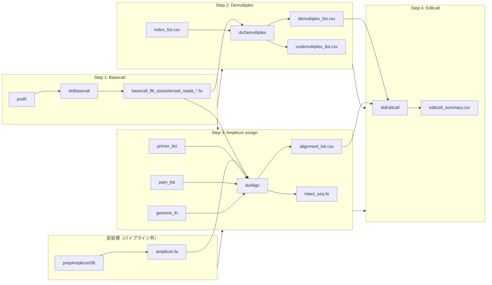

# miaoseq コード整理計画

作成日: 2026-07-07  
対象ブランチ: `devel`（`R/functions.R` 単一ファイル構成）

## 1. 目的

パイプラインを以下の4ステップに沿って、**関数単位・ファイル単位で明確に分離**する。

| # | ステップ | 概要 |
|---|----------|------|
| 1 | ベースコール | pod5 → FASTQ/FASTA |
| 2 | バーコード分類 | インデックス配列に基づきリードをサンプルに割り当て |
| 3 | アンプリコン分類 | 各リードを遺伝子/編集対象アンプリコンに割り当て |
| 4 | 編集パターン検出 | 分類済みアンプリコンからゲノム編集アウトカムを呼び出し |

加えて、前処理・オーケストレーション・レポート用のモジュールを分離する。

---

## 2. 現状の構成

### 2.1 ファイル構成

```
R/
  functions.R    # 全機能が1ファイル（約1,405行）
```

`NAMESPACE` は roxygen2 生成。`man/` に各エクスポート関数の Rd あり。

### 2.2 関数一覧と行番号

| 区分 | 関数 | 行 | export | 備考 |
|------|------|-----|--------|------|
| 前処理 | `prepAmpliconDB` | 49–130 | ✓ | ゲノム+プライマーからアンプリコンDB構築 |
| BLAST共通 | `.makeblastdb` | 132–143 | — | 内部関数 |
| BLAST共通 | `.run_blastn` | 145–180 | — | 内部関数 |
| BLAST共通 | `.parse_blastout` | 182–196 | — | 内部関数 |
| ユーティリティ | `makeMMI` | 203–206 | ✓* | minimap2 index 作成（dorado用） |
| パイプライン | `miaoEditcall` | 278–381 | ✓ | 4ステップを順次実行 |
| パイプライン | `.check_files` | 383–391 | — | **空実装のスタブ** |
| **Step 1** | `doBasecall` | 416–476 | ✓ | pod5 → BAM → FASTQ → サイズ選択済みFASTA |
| **Step 2** | `doDemultiplex` | 500–545 | ✓ | バーコード demultiplex |
| Step 2 内部 | `.loopBLAST` | 547–577 | — | リードchunkごとのBLAST |
| Step 2 内部 | `.loopParse` | 579–665 | — | BLAST結果の分類ロジック |
| **Step 3** | `doAlign` | 695–898 | ✓ | アンプリコンへのリード割り当て |
| **Step 4** | `doEditcall` | 921–1082 | ✓ | 編集パターン集計・genotype呼び出し |
| レポート | `evalMiao` | 1098–1231 | ✓ | 各ステップの統計サマリー |
| レポート | `editViewer` | 1258–1404 | ✓ | プレートヒートマップPDF |

\* `makeMMI` は roxygen `@export` があるが `NAMESPACE` には未登録（不整合）。

### 2.3 パイプラインのデータフロー（現状）



**重要な設計上の特徴:**

- Step 2 と Step 3 は **並列に Step 1 の出力（basecall FASTA）を消費**する。Step 3 は demultiplex 結果を参照しない。
- Step 2 と Step 3 の結合は **Step 4 (`doEditcall`) の `left_join` で初めて行われる**（921–928行）。
- サイズ選択 (`size_sel`) は Step 1 (`doBasecall`) 内で実施される。

### 2.4 各ステップの入出力詳細

#### Step 1: `doBasecall`

| 項目 | 内容 |
|------|------|
| 入力 | `in_dir`（pod5）, `dorado_path`, `samtools_path`, 任意で `mmi_fn`/`bed_fn` |
| 処理 | dorado duplex sup → BAM → duplex除去 → FASTQ → 長さフィルタ → FASTA分割（1万リード/chunk） |
| 出力dir | `{out_dir}/basecall/` |
| 主な出力 | `basecall.bam`, `basecalls_summary.tsv`, `basecall_filt_sizeselected_reads_NNN.fa`, `basecall.finish` |
| 戻り値 | サイズ選択済みFASTAファイルパスのベクトル |

#### Step 2: `doDemultiplex`

| 項目 | 内容 |
|------|------|
| 入力 | `basecall_fn`（Step 1出力）, `index_list`（5列CSV: index_pair_id, f_index_id, f_seq, r_index_id, r_seq） |
| 処理 | ユニークなF/RインデックスをBLAST → リード両端のバーコード位置判定 → 3段階分類（complete/single/partial match） |
| 出力dir | `{out_dir}/demultiplex/` |
| 主な出力 | `demultiplex_list.csv`, `undemultiplex_list.csv`, `f_index.fa`, `r_index.fa` |
| 戻り値 | 分類成功リードの data.frame（`index_pair_id` 付き） |

分類ロジック（`.loopParse`）:
1. F/Rバーコードがリードの異なる端（front/rear）にあるペアのみ採用
2. `complete_match`: 完全一致 + フルカバレッジ
3. `single_match`: 候補が1つのみ
4. `partial_match`: 変異数が最小の候補を採用

#### Step 3: `doAlign`（実質: アンプリコン分類）

| 項目 | 内容 |
|------|------|
| 入力 | `basecall_fn`, `amplicon_fn`, `primer_list`, `pam_list`, `genome_fn`, `check_window` |
| 処理 | アンプリコンをquery・リードをDBとしてBLAST → マルチヒット解決 → PAM周辺の編集領域抽出 → intact配列との比較 |
| 出力dir | `{out_dir}/align/` |
| 主な出力 | `alignment_list.csv`, `intact_seq.fa` |
| 戻り値 | アラインメント結果 data.frame + `intact_seq` 属性 |

**命名上の問題:** 関数名は `doAlign` だが、実際の役割は「リードをアンプリコン（target_gene）に分類し、編集検出対象配列を切り出す」こと。BLASTベースの割り当てであり、一般的な意味のアラインメントパイプライン（BWA/minimap2等）ではない。

#### Step 4: `doEditcall`

| 項目 | 内容 |
|------|------|
| 入力 | `demult_out`（Step 2）, `align_out`（Step 3）, 任意で `sample_list`, `strict` |
| 処理 | demultiplex結果とalign結果を結合 → リード配列を集計 → genotype分類（ref/sub/ins/del/indel） → サマリー生成 |
| 出力dir | `{out_dir}/editcall/` |
| 主な出力 | `editcall_all.csv`, `editcall_filtered.csv`, `editcall_summary.csv` |
| 戻り値 | サンプル×遺伝子のgenotypeサマリー data.frame |

genotype判定（1004–1024行）:
- `ref`: intact配列と一致
- `sub`: 置換
- `del`/`ins`/`indel`: ギャップパターンに基づく

---

## 3. 現状の問題点

### 3.1 構造上の問題

1. **単一巨大ファイル** — 4ステップ + 前処理 + レポートが混在し、変更影響範囲が不明瞭
2. **BLAST共通関数の重複利用** — `prepAmpliconDB`, `doDemultiplex`, `doAlign` の3箇所で `.makeblastdb`/`.run_blastn`/`.parse_blastout` を共有しているが、同一ファイル内の暗黙依存
3. **ステップ間の結合が Step 4 に集中** — Step 3 が demultiplex を意識しない設計は意図的かもしれないが、インターフェースとして文書化・型定義されていない
4. **関数名と実態の乖離** — `doAlign` はアンプリコン分類、`doEditcall` は編集パターン検出

### 3.2 コード上のバグ・不整合

| 問題 | 箇所 | 詳細 |
|------|------|------|
| `n_core` 未渡し | `.loopBLAST` (561, 573行), `doAlign` (722行) | 引数に `n_core` がないのに参照している。呼び出し元のスコープかグローバルに依存 |
| `makeMMI` の export 不整合 | 203行 vs NAMESPACE | `@export` あるが NAMESPACE 未登録 |
| `.check_files` 空実装 | 383–391行 | 未使用スタブ |
| roxygen の引数不一致 | `doAlign` のドキュメント | `demult_out` が@paramに記載されているが関数引数に存在しない |

### 3.3 スコープ外

`refless` ブランチはマージせず削除する可能性が高いため、本整理計画の対象外とする。`devel` 上の `R/functions.R` のみを基準に進める。

---

## 4. 推奨ファイル構成

### 4.1 提案ディレクトリ構造

```
R/
  blast_utils.R          # BLAST共通内部関数
  prep_amplicon_db.R     # 前処理: アンプリコンDB構築
  basecall.R             # Step 1
  demultiplex.R          # Step 2
  amplicon_assign.R      # Step 3（doAlign をここに配置）
  editcall.R             # Step 4
  pipeline.R             # miaoEditcall オーケストレーション
  report.R               # evalMiao, editViewer
```

`functions.R` は削除（または移行完了後に削除）。

### 4.2 ファイル別の関数配置

#### `R/blast_utils.R`（新規・共通基盤）

| 関数 | 移動元 | 公開 |
|------|--------|------|
| `.makeblastdb` | functions.R:132 | internal |
| `.run_blastn` | functions.R:145 | internal |
| `.parse_blastout` | functions.R:182 | internal |

`prepAmpliconDB`, `doDemultiplex`, `amplicon_assign` の3モジュールから参照。

#### `R/prep_amplicon_db.R`（前処理）

| 関数 | 移動元 | 公開 |
|------|--------|------|
| `prepAmpliconDB` | functions.R:49 | export |

パイプライン4ステップの**前**に実行するセットアップ。ユーザーが定義する4ステップには含めないが、独立ファイルとして維持。

#### `R/basecall.R`（Step 1）

| 関数 | 移動元 | 公開 |
|------|--------|------|
| `doBasecall` | functions.R:416 | export |
| `makeMMI` | functions.R:203 | export（NAMESPACE修正） |

#### `R/demultiplex.R`（Step 2）

| 関数 | 移動元 | 公開 |
|------|--------|------|
| `doDemultiplex` | functions.R:500 | export |
| `.loopBLAST` | functions.R:547 | internal |
| `.loopParse` | functions.R:579 | internal |

**整理時の修正:** `.loopBLAST` に `n_core` 引数を追加し、`doDemultiplex` から渡す。

#### `R/amplicon_assign.R`（Step 3）

| 関数 | 移動元 | 公開 |
|------|--------|------|
| `doAlign` | functions.R:695 | export（リネーム検討、後述） |

**整理時の修正:**
- `n_core` を関数引数に追加
- roxygen から存在しない `demult_out` 引数を削除

**リネーム案（任意・破壊的変更）:**

| 現名 | 候補 | 理由 |
|------|------|------|
| `doAlign` | `doAmpliconAssign` | アンプリコンへの分類が本質 |
| `doDemultiplex` | `doBarcodeAssign` | バーコード配列による分類 |
| `doEditcall` | `doEditDetect` | 編集パターン検出 |

後方互換が必要なら現名を維持し、エイリアス関数を残す。

#### `R/editcall.R`（Step 4）

| 関数 | 移動元 | 公開 |
|------|--------|------|
| `doEditcall` | functions.R:921 | export |

将来的に genotype 判定ロジック（1004–1024行）を `.classify_genotype()` 等の内部関数に切り出すとテストしやすい。

#### `R/pipeline.R`

| 関数 | 移動元 | 公開 |
|------|--------|------|
| `miaoEditcall` | functions.R:278 | export |

`.check_files` は実装するか削除するかを決定（現状は削除推奨）。

#### `R/report.R`

| 関数 | 移動元 | 公開 |
|------|--------|------|
| `evalMiao` | functions.R:1098 | export |
| `editViewer` | functions.R:1258 | export |

---

## 5. ステップ間インターフェースの明確化

整理時に各ステップの **入出力契約** をコメントまたはドキュメントで固定する。

```r
# 概念インターフェース（実装は data.frame / ファイルパス）

# Step 1 → Step 2, Step 3
BasecallResult <- list(
  fasta_chunks = character(),   # 分割FASTAパスベクトル
  output_dir   = character()
)

# Step 2 → Step 4
DemultiplexResult <- list(
  assignments  = data.frame(),  # demultiplex_list.csv 相当
  unassigned   = data.frame(),  # undemultiplex_list.csv 相当
  output_dir   = character()
)

# Step 3 → Step 4
AmpliconAssignResult <- list(
  alignments   = data.frame(),  # alignment_list.csv 相当
  intact_seq   = DNAStringSet,  # intact_seq.fa 相当
  output_dir   = character()
)

# Step 4
EditcallResult <- list(
  summary      = data.frame(),  # editcall_summary.csv 相当
  output_dir   = character()
)
```

現状はフラットな data.frame 返却 + ファイル書き出しだが、整理フェーズでは **ファイルI/Oと計算ロジックの分離** も検討余地あり（優先度は低）。

---

## 6. 実装手順（推奨フェーズ）

### Phase 0: 準備（影響なし）

- [ ] 本計画のレビュー・合意
- [ ] `makeMMI` の NAMESPACE 不整合を修正
- [ ] `n_core` バグを修正（`.loopBLAST`, `doAlign`）

### Phase 1: ファイル分割（挙動変更なし）

- [ ] `blast_utils.R` を切り出し
- [ ] 各ステップファイルを作成し関数を移動
- [ ] `functions.R` を削除
- [ ] `devtools::document()` で NAMESPACE / man を再生成
- [ ] 既存の `sample_script.R` で動作確認

### Phase 2: インターフェース整理（軽微な改善）

- [ ] 各 `do*` 関数の roxygen を実態に合わせて修正
- [ ] `.check_files` を削除または実装
- [ ] ステップごとの入出力を README に追記

### Phase 3: 命名・API改善（任意・破壊的変更）

- [ ] `doAlign` → `doAmpliconAssign` 等のリネーム
- [ ] 旧名の deprecated エイリアスを1バージョン維持
- [ ] genotype 判定の内部関数化 + ユニットテスト追加


---

## 7. テスト・検証方針

現状テストスイートは存在しない。整理と並行して最低限以下を推奨:

| 対象 | 方法 |
|------|------|
| `.parse_blastout` | 固定BLAST出力TSVを入力とするユニットテスト |
| `.loopParse` | モックBLASTヒットでの分類結果テスト |
| genotype判定（Step 4） | 既知の read_seq / ref_seq ペアでの期待genotypeテスト |
| パイプライン全体 | `inst/extdata/` + 小規模pod5サブセットでのインテグレーションテスト |

テスト配置案: `tests/testthat/test-*.R`

---

## 8. 関数 → ステップ対応まとめ

```
前処理（パイプライン外）
  prepAmpliconDB          → prep_amplicon_db.R

Step 1: pod5ベースコール
  doBasecall              → basecall.R
  makeMMI                 → basecall.R（補助）

Step 2: バーコード分類
  doDemultiplex           → demultiplex.R
  .loopBLAST              → demultiplex.R（内部）
  .loopParse              → demultiplex.R（内部）

Step 3: アンプリコン分類
  doAlign                 → amplicon_assign.R

Step 4: 編集パターン検出
  doEditcall              → editcall.R

共通
  .makeblastdb            → blast_utils.R
  .run_blastn             → blast_utils.R
  .parse_blastout         → blast_utils.R

オーケストレーション
  miaoEditcall            → pipeline.R

レポート・可視化
  evalMiao                → report.R
  editViewer              → report.R
```

---

## 9. 未決事項（レビュー時に決定）

1. **`doAlign` のリネーム** — `doAmpliconAssign` にするか、後方互換のため現名維持か
2. **Step 3 で demultiplex 済みリードのみ処理するか** — 現状は全リードを処理し Step 4 で結合。仕様として正しいか確認
3. **`.check_files` の扱い** — 削除 vs 入力検証の実装
4. **テスト追加のスコープ** — Phase 1 と同時か Phase 2 以降か

---

## 10. 参考: 現行パイプライン呼び出し順（`miaoEditcall`）

```r
# pipeline.R に相当（現: functions.R:278-381）

basecall_fn <- doBasecall(...)           # Step 1
demult_out  <- doDemultiplex(...)        # Step 2  ← basecall_fn
align_out   <- doAlign(...)              # Step 3  ← basecall_fn（demult_outは未使用）
editcall_out <- doEditcall(              # Step 4  ← demult_out + align_out
  demult_out, align_out, ...
)
```

この呼び出し順序と出力ディレクトリ構造（`basecall/`, `demultiplex/`, `align/`, `editcall/`）は整理後も **維持** することを推奨する。既存の `evalMiao` / `editViewer` / ユーザースクリプトとの互換性のため。
