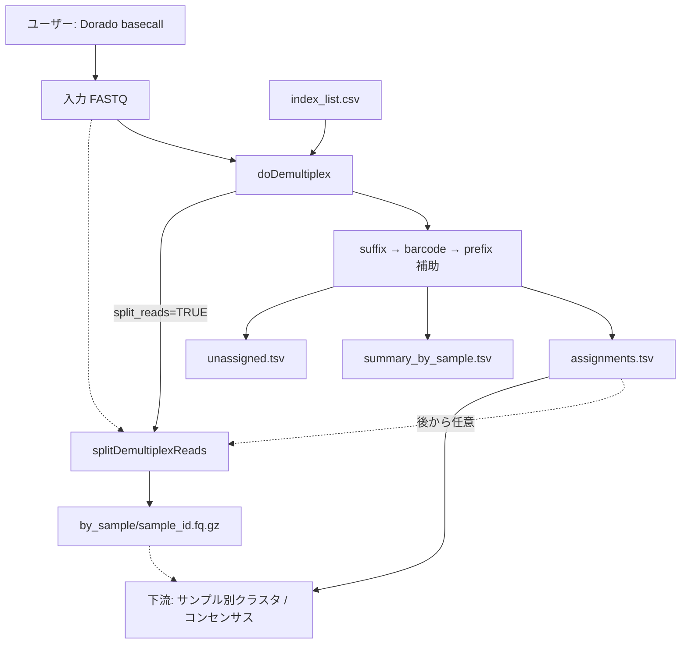

# デマルチプレックス改訂計画: edlib ベース index 判定

作成日: 2026-07-08  
改訂:
- 2026-07-08 — **2段階方式**（アンカー検出 → barcode 抽出・照合）に変更
- 2026-07-08 — **suffix 中心 + prefix 補助**（truncate 許容 / 曖昧ケースのみ rescue）に変更
- 2026-07-08 — **出力を assignments 表中心に変更**、`splitDemultiplexReads()` 分離、`basecall.R` 廃止方針を反映
参照:
- [cursor_dev/ontbarcoder_demux.md](ontbarcoder_demux.md)
- [cursor_dev/pipeline_revise.md](pipeline_revise.md)
対象: `R/demultiplex.R` の `doDemultiplex`（現行 BLAST 実装の置き換え）

---

## 1. 目的

デマルチプレックスを **edlib** ベースの **2段階 + 任意 prefix 検証** に刷新する。

```
(1) suffix アンカーで位置・方向を特定（緩い閾値）          … 必須・高速ルート
(2) 近傍から barcode 配列を切り出し、辞書で厳密に照合（厳しい閾値）
(3) prefix は非必須。見つかれば信頼度を上げ、曖昧ケースのみ rescue
(4) 主出力は割り当て表。サンプル別 FASTQ は splitDemultiplexReads() で任意生成
```

パイプライン上の位置づけ:

- **入力 FASTQ はユーザーが準備**（Dorado basecall は R 外で実行）
- `R/basecall.R` / `doBasecall` / `makeMMI` は **廃止**
- demux の責務は **分類のみ**（必要なら split も呼べる）

ONTbarcoder の安全策を取り入れる。

| 安全策 | 内容 |
|--------|------|
| primer/tag 分離 | 固定アンカー（位置）と可変 barcode（同定）を分離 |
| 衝突除去 | barcode 変異体が複数 ID にマッチする場合は棄却 |
| 明確な閾値 | アンカー許容距離と barcode 許容距離を別パラメータ化 |
| 両端ウィンドウ | リード全体ではなく両端の限定領域のみ探索 |
| prefix 補助 | 末端 truncate を許容しつつ、曖昧ケースで精度を補完 |
| I/O 分離 | 割り当て表を主出力、サンプル別 FASTQ は別関数で任意生成 |

---

## 2. 設計方針の変更理由

### 2.1 当初案（42 bp 一体型の直接照合）の問題

当初案では 42 bp index 全体を edlib でスコアリングする方針だったが、**不適切**である。

| 問題 | 説明 |
|------|------|
| primer/adapter 変異がスコアに混入 | 42 bp のうち約 76% はサンプル間で共通の固定領域。ここに ONT エラーがあると barcode 部分が完全一致でも棄却される |
| 閾値の意味が不明瞭 | 「index 全体で 3 bp 許容」は、barcode 10 bp 部分の 1 bp エラーと adapter 32 bp 部分の 3 bp エラーを区別できない |
| ONTbarcoder との乖離 | ONTbarcoder は primer 位置特定（緩い）と tag 照合（厳しい）を分離している |

### 2.2 barcode 同定方針

**primer 部分（固定アンカー）の変異はスコアに影響させず、barcode 部分のみでサンプル同定を行う。**

1. **アンカー検出** — suffix を edlib で緩くマッチ（位置・方向の特定のみ）
2. **barcode 抽出** — アンカー近傍から可変領域（10 bp）を切り出し
3. **barcode 照合** — 10 bp のみを変異体辞書 + 厳しい閾値で lookup
4. **prefix 補助** — 非必須。曖昧時のみ rescue

### 2.3 出力方針（割り当て表中心）

下流は「サンプルごとに分類されたリード」についてクラスタリング / コンセンサスを行う。

| 方式 | 採用 |
|------|------|
| **assignments.tsv + 元 FASTQ 参照** | **主出力（必須）** |
| **サンプル別 FASTQ** | **任意**（`splitDemultiplexReads()`） |

理由:

- demux を軽く保ち、384 サンプル規模でも I/O が爆発しない
- 閾値再チューニング時に FASTQ 再分割が不要
- 下流は assignments に従い、必要なときだけリードを抽出できる
- 外部ツールや HPC サンプル単位ジョブには後から split できる

### 2.4 basecall の扱い

| 旧 | 新 |
|----|----|
| `doBasecall()` が Dorado を R から呼ぶ | **廃止**。Dorado はユーザーが別途実行 |
| FASTA チャンクを内部生成 | ユーザー提供の **FASTQ** を入力 |
| `makeMMI()` | demux からは不要（参考補助として残すかは pipeline 側で別途判断） |

---

## 3. miaoseq index 配列の内部構造

`inst/extdata/index_list.csv` の 42 bp 配列は、見かけ上一体型だが **3領域に分解できる**（全 384 ペアで確認済み）。

### 3.1 Forward index（42 bp）

```
[共通 prefix 10bp] [可変 barcode 10bp] [共通 suffix 22bp]
 CATACGAGAT         CGCTCAGTTC          GTGACTGGAGTTCAGACGTGTG
 ^外側 adapter     ^サンプル識別子      ^アンプリコン側（主アンカー）
```

### 3.2 Reverse index（41 bp）

```
[共通 prefix 10bp] [可変 barcode 10bp] [共通 suffix 21bp]
 CATACGAGAT         TCGTGGAGCG          ACACTCTTTCCCTACACGACG
```

### 3.3 設計パラメータ（実測値）

| 項目 | F | R |
|------|---|---|
| ユニーク barcode 数 | 32 | 32 |
| barcode 長 | 10 bp | 10 bp |
| barcode 間の最小編集距離 | **3 bp** | **4 bp** |
| barcode 間の平均編集距離 | 6.5 bp | 6.5 bp |

### 3.4 アンカーとしての prefix / suffix の役割

```
5' [prefix][barcode][suffix]---[アンプリコン]---[suffix][barcode][prefix] 3'
      ^任意補助                      ^主アンカー（必須）
```

| 端 | 役割 | 配列 | 必須？ |
|----|------|------|--------|
| F/R 端 | **主アンカー** | suffix（アンプリコン隣接） | **必須** |
| F/R 端 | **補助アンカー** | prefix（外側末端） | **任意**（truncate 許容） |
| F/R 端 | barcode 抽出 | suffix 直前 10 bp | 必須 |

> **注**: `amplicon_primers.csv` の遺伝子プライマーは demux には使わない（アンプリコン処理側）。

---

## 4. 依存パッケージ

### 4.1 edlibR

```r
edlibR::align(query, target, mode = "HW", task = "locations", k = max_edit)
```

| 段階 | mode | 用途 |
|------|------|------|
| suffix アンカー検出 | `HW` | 端ウィンドウ内の infix として位置特定（必須） |
| prefix 検証 / rescue | `HW` | barcode 外側近傍での補助確認（任意・条件付き） |
| barcode 照合 | 辞書 lookup 優先、必要時 edlib `NW` | 10 bp 短配列の厳密照合 |

### 4.2 DESCRIPTION への追加 / 削除

```
Imports:
    edlibR
```

`doBasecall` 廃止に伴い、Dorado / samtools 呼び出し前提の記述は Description / README から除去する。BLAST は demux では不要（他ステップで使う場合は残す）。

---

## 5. アルゴリズム概要

```
ユーザー提供 FASTQ
  → Phase A: index_list 分解 + barcode 辞書構築 + 衝突除去
  → Phase B: リードごとに
       (1) 両端 window 抽出
       (2) suffix 検出（必須）
       (3) barcode 切り出し・照合
       (4) prefix 任意検証（ラベル）
       (5) 曖昧時のみ prefix_rescue
       (6) F/R ペアが一意なら割り当て
  → Phase C: assignments / summary / unassigned を書き出し
  → Phase D (任意): split_reads=TRUE なら splitDemultiplexReads() を呼ぶ
```

### ONTbarcoder との対応

| ONTbarcoder | miaoseq 改訂版 |
|-------------|---------------|
| primer 検出（edlib, ≤10） | **suffix 検出**（≤ `max_anchor_edit`）※必須 |
| （なし） | **prefix 検証 / rescue**（任意） |
| tag 切り出し | **barcode 切り出し**（suffix 直前 10 bp） |
| tag 辞書 lookup（≤2） | **barcode 辞書 lookup**（≤ `max_barcode_edit`） |
| サンプル別 FASTA 出力 | **任意**: `splitDemultiplexReads()` |
| 両端 window 100 bp | `end_window`（デフォルト 60 bp） |

---

## 6. Phase A: 辞書構築

### 6.1 `.parse_index_layout(index_list)`

```r
list(
  f_prefix  = "CATACGAGAT",
  f_suffix  = "GTGACTGGAGTTCAGACGTGTG",
  f_barcode_len = 10,
  r_prefix  = "CATACGAGAT",
  r_suffix  = "ACACTCTTTCCCTACACGACG",
  r_barcode_len = 10,
  f_barcodes = named character(),
  r_barcodes = named character(),
  sample_map = data.frame()        # f_id, r_id, index_pair_id
)
```

### 6.2 `.build_barcode_dict(barcodes, max_barcode_edit = 2)`

barcode 10 bp のみの変異体辞書 + 衝突除去。

### 6.3 `.validate_barcode_design()`

F barcode min dist = 3, R = 4。`max_barcode_edit = 2` では衝突除去必須。

---

## 7. Phase B: リードごとの判定

### 7.1 パラメータ

| パラメータ | デフォルト | 段階 | 説明 |
|-----------|-----------|------|------|
| `end_window` | `60` | 共通 | 両端探索ウィンドウ長（bp） |
| `max_anchor_edit` | `10` | suffix | 必須アンカー許容編集距離 |
| `max_prefix_edit` | `5` | prefix | prefix 検証 / rescue 許容編集距離 |
| `max_barcode_edit` | `2` | barcode | barcode 許容編集距離 |
| `require_prefix` | `FALSE` | prefix | `TRUE` なら prefix 必須（非推奨） |
| `prefix_rescue` | `TRUE` | prefix | 曖昧時のみ prefix 再確認 |
| `require_unique_pair` | `TRUE` | ペア | 有効ペアが一意でなければ未割り当て |
| `allow_revcomp` | `TRUE` | 共通 | 逆相補も探索 |
| `split_reads` | `FALSE` | 出力 | `TRUE` なら末尾で `splitDemultiplexReads()` を呼ぶ |

### 7.2 通常パス

1. **suffix 検出（必須）** — 失敗なら unassigned  
2. **barcode 切り出し** — suffix 直前 10 bp  
3. **barcode 照合** — 辞書 / edlib。`barcode_edit_*` に barcode 距離のみ記録  
4. **prefix 任意検証** — 検出なら `high_confidence`、未検出なら `partial_anchor`（棄却しない）  

### 7.3 prefix_rescue（曖昧時のみ）

曖昧条件の例: barcode 同点、閾値付近、複数ペア候補、端境界ヒット。  
rescue 成功 → `rescued`、失敗 → unassigned。

### 7.4 分類ラベル

| 列 | 値 |
|----|----|
| `match_class` | `complete_match` / `fuzzy_match` |
| `anchor_status` | `high_confidence` / `partial_anchor` / `rescued` |
| unassigned `reason` | `no_suffix` / `barcode_fail` / `ambiguous_pair` / `rescue_fail` / ... |

---

## 8. Phase C / D: 入出力仕様

### 8.1 入力

| 入力 | 内容 |
|------|------|
| `fastq` | ユーザー提供 FASTQ（単一パス、またはチャンクの character ベクトル）。`.fq` / `.fastq` / `.gz` 対応 |
| `index_list` | 既存 5 列 CSV（index_pair_id, f_id, f_seq, r_id, r_seq） |
| `sample_list` | 任意。index_pair_id → sample_name 等のマップ |
| `demult_dir` | 出力ディレクトリ |

**破壊的変更**:

- `blast_path` 削除
- `basecall_fn`（FASTA）→ `fastq`（FASTQ）
- `doBasecall` 前提のチャンク命名に依存しない

### 8.2 出力ディレクトリ構造

```
demultiplex/
  assignments.tsv              # 必須・主出力
  summary_by_sample.tsv        # 必須
  unassigned.tsv               # 必須
  index_layout.tsv             # 診断
  barcode_conflicts.tsv        # 診断
  design_check.tsv             # 診断
  by_sample/                   # 任意（split_reads=TRUE または別途 split）
    {sample_id}.fq.gz
    unassigned.fq.gz           # オプション
```

### 8.3 `assignments.tsv`（主出力）

```tsv
read_id
index_pair_id
f_index_id
r_index_id
sample_id
source_file
barcode_edit_f
barcode_edit_r
match_class
anchor_status
prefix_edit_f
prefix_edit_r
```

- `sample_id`: `sample_list` があればサンプル名、なければ `index_pair_id`
- `source_file`: 入力が複数 FASTQ のとき、当該リードの由来ファイル
- quality / 配列本体は **持たない**（元 FASTQ を参照）

### 8.4 `summary_by_sample.tsv`

```tsv
sample_id
index_pair_id
n_reads
n_complete
n_fuzzy
n_high_confidence
n_partial_anchor
n_rescued
```

### 8.5 `unassigned.tsv`

```tsv
read_id
reason
source_file
```

### 8.6 戻り値

```r
list(
  assignments = data.frame(),
  summary     = data.frame(),
  unassigned  = data.frame(),
  demult_dir  = character(1)
)
```

旧 `demultiplex_list.csv` / BLAST 風列（`qseqid.f`, `send.f` 等）は **維持しない**。パイプライン再構築前提。

---

## 9. API 設計

### 9.1 `doDemultiplex()`

```r
doDemultiplex <- function(fastq,
                          demult_dir,
                          index_list,
                          sample_list = NULL,
                          n_core = 1,
                          end_window = 60,
                          max_anchor_edit = 10,
                          max_prefix_edit = 5,
                          max_barcode_edit = 2,
                          require_prefix = FALSE,
                          prefix_rescue = TRUE,
                          require_unique_pair = TRUE,
                          allow_revcomp = TRUE,
                          split_reads = FALSE,
                          compress = TRUE) {
  # ... 分類 ...
  # write assignments.tsv / summary / unassigned

  if (isTRUE(split_reads)) {
    splitDemultiplexReads(
      fastq       = fastq,
      assignments = file.path(demult_dir, "assignments.tsv"),
      out_dir     = file.path(demult_dir, "by_sample"),
      compress    = compress,
      n_core      = n_core
    )
  }

  list(assignments = ..., summary = ..., unassigned = ..., demult_dir = demult_dir)
}
```

ポイント:

- **常に割り当て表を書く**
- `split_reads = TRUE` のときだけ `splitDemultiplexReads()` を内部呼び出し
- `split_reads = FALSE` で走らせたあと、**後から独立に** `splitDemultiplexReads()` 可能

### 9.2 `splitDemultiplexReads()`（新規・export）

```r
splitDemultiplexReads <- function(fastq,
                                  assignments,
                                  out_dir,
                                  compress = TRUE,
                                  include_unassigned = FALSE,
                                  unassigned = NULL,
                                  n_core = 1) {
  # assignments: data.frame または TSV パス
  # fastq をストリームし、read_id → sample_id で振り分け
  # out_dir/{sample_id}.fq(.gz) を生成
}
```

| 引数 | 説明 |
|------|------|
| `fastq` | 元の入力 FASTQ（`doDemultiplex` と同じ） |
| `assignments` | `assignments.tsv` パス、または data.frame |
| `out_dir` | 通常 `demultiplex/by_sample` |
| `compress` | `.fq.gz` 出力 |
| `include_unassigned` | `TRUE` なら `unassigned.fq.gz` も書く |
| `unassigned` | `include_unassigned` 用の表（パス or data.frame） |

実装メモ:

- 全サンプルのファイルハンドルを開き、1 パスで振り分け（384 本程度なら現実的）
- メモリに全リードを載せない
- `read_id` は FASTQ ヘッダの最初のトークンと一致させる

### 9.3 内部関数一覧

```
R/demultiplex.R（または demultiplex_edlib.R を吸収）
  doDemultiplex()                 # export
  splitDemultiplexReads()         # export

  .parse_index_layout()
  .build_barcode_dict()
  .validate_barcode_design()
  .find_suffix_anchor()
  .extract_barcode()
  .match_barcode()
  .check_prefix_optional()
  .is_ambiguous_hit()
  .prefix_rescue()
  .score_read_indices()
  .demultiplex_chunk()
  .write_demultiplex_tables()
  .split_fastq_by_assignment()    # splitDemultiplexReads の実体
```

---

## 10. 実装フェーズ

### Phase 1: 基盤

- [x] `edlibR` を DESCRIPTION に追加
- [x] `.parse_index_layout()` / `.build_barcode_dict()` / 衝突除去
- [ ] ユニットテスト: 分解・衝突除去（自動テストスイートは未整備）

### Phase 2: コア分類

- [x] suffix → barcode → prefix 補助アルゴリズム
- [x] `doDemultiplex()` を edlib 版に置き換え（assignments 出力）
- [x] `blast_path` / 旧 CSV 列を除去
- [x] 合成リードでの確認（truncate / fuzzy / junk）

### Phase 3: split

- [x] `splitDemultiplexReads()` 実装
- [x] `doDemultiplex(split_reads = TRUE)` から呼び出し
- [x] 後から単独実行できることを確認
- [x] 振り分け件数 = assignments 件数（合成テスト）

### Phase 4: パイプライン統合

- [ ] `basecall.R` / `doBasecall` / `makeMMI` 廃止（詳細は pipeline_revise.md）
- [ ] `miaoEditcall` / `doEditcall` を新 assignments 仕様に合わせて再設計
- [x] NAMESPACE / man 更新（`splitDemultiplexReads` export）
- [ ] README 更新

---

## 11. テスト計画

| テスト | 検証内容 |
|--------|---------|
| `test-anchor-error-tolerant` | suffix エラーでも barcode OK → 割り当て |
| `test-barcode-error-strict` | barcode 過大エラー → unassigned |
| `test-prefix-truncate` | prefix 欠失 → `partial_anchor` で割り当て |
| `test-prefix-rescue` | 曖昧 → rescued |
| `test-assignments-only` | `split_reads=FALSE` で by_sample が無い |
| `test-split-from-doDemultiplex` | `split_reads=TRUE` で by_sample 生成 |
| `test-split-standalone` | 後から `splitDemultiplexReads()` で同内容を生成 |
| `test-split-counts` | 各 sample FASTQ のリード数 = summary |

---

## 12. パラメータチューニング指針

| パラメータ | デフォルト | 備考 |
|-----------|-----------|------|
| `max_anchor_edit` | 10 | ONTbarcoder primer 相当 |
| `max_prefix_edit` | 5 | rescue / ラベル用 |
| `max_barcode_edit` | 2 | 衝突除去必須 |
| `require_prefix` | FALSE | truncate 許容 |
| `prefix_rescue` | TRUE | 曖昧時のみコスト |
| `split_reads` | FALSE | 必要時のみ I/O |

---

## 13. 処理フロー図



---

## 14. 成功基準

1. barcode 同定が suffix/prefix 変異と独立
2. prefix truncate でも割り当て可能
3. 主出力が assignments 表であり、下流がそれで動く
4. `split_reads=FALSE` 後に単独 `splitDemultiplexReads()` で同結果を得られる
5. BLAST demux より高速
6. basecall を R 経由で呼ばなくても demux が完結する

---

## 15. 参考

- [cursor_dev/pipeline_revise.md](pipeline_revise.md)
- [cursor_dev/ontbarcoder_demux.md](ontbarcoder_demux.md)
- [cursor_dev/code_reorganize_plan.md](code_reorganize_plan.md)
- [edlibR CRAN](https://cran.r-project.org/package=edlibR)
- 現行実装: `R/demultiplex.R`, `R/basecall.R`（廃止予定）, `R/pipeline.R`
