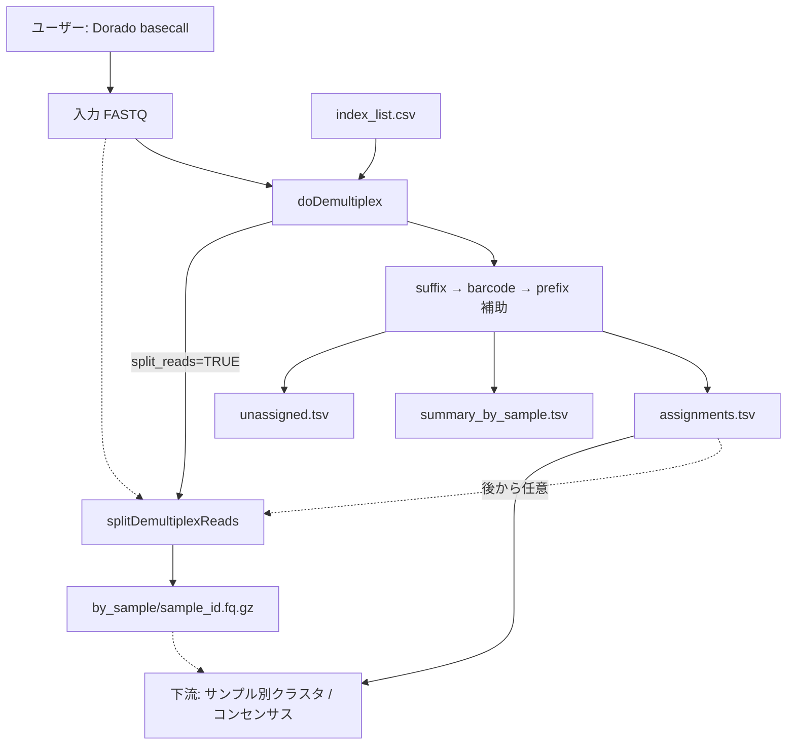

# デマルチプレックス改訂計画: edlib ベース index 判定

作成日: 2026-07-08  
改訂:
- 2026-07-08 — **2段階方式**（アンカー検出 → barcode 抽出・照合）に変更
- 2026-07-08 — **suffix 中心 + prefix 補助**（truncate 許容 / 曖昧ケースのみ rescue）に変更
- 2026-07-08 — **出力を assignments 表中心に変更**、`splitDemultiplexReads()` 分離、`basecall.R` 廃止方針を反映
- 2026-07-08 — **速度: ホットパスは C++（Rcpp+edlib）**。R は API / I/O のみ（§15）
参照:
- [cursor_dev/ontbarcoder_demux.md](ontbarcoder_demux.md)
- [cursor_dev/pipeline_revise.md](pipeline_revise.md)
対象: `R/demultiplex.R` の `doDemultiplex`（現行 BLAST 実装の置き換え）

---

## 1. 目的

デマルチプレックスを **edlib** ベースの **2段階 + 任意 prefix 検証** に刷新する。

```
(1) suffix アンカーで位置・方向を特定（緩い閾値）          … 必須・高速ルート
(2) 近傍から barcode 配列を切り出し、辞書で厳密に照合（厳しい閾値）
(3) prefix は非必須。見つかれば信頼度を上げ、曖昧ケースのみ rescue
(4) 主出力は割り当て表。サンプル別 FASTQ は splitDemultiplexReads() で任意生成
```

パイプライン上の位置づけ:

- **入力 FASTQ はユーザーが準備**（Dorado basecall は R 外で実行）
- `R/basecall.R` / `doBasecall` / `makeMMI` は **廃止**
- demux の責務は **分類のみ**（必要なら split も呼べる）

ONTbarcoder の安全策を取り入れる。

| 安全策 | 内容 |
|--------|------|
| primer/tag 分離 | 固定アンカー（位置）と可変 barcode（同定）を分離 |
| 衝突除去 | barcode 変異体が複数 ID にマッチする場合は棄却 |
| 明確な閾値 | アンカー許容距離と barcode 許容距離を別パラメータ化 |
| 両端ウィンドウ | リード全体ではなく両端の限定領域のみ探索 |
| prefix 補助 | 末端 truncate を許容しつつ、曖昧ケースで精度を補完 |
| I/O 分離 | 割り当て表を主出力、サンプル別 FASTQ は別関数で任意生成 |

---

## 2. 設計方針の変更理由

### 2.1 当初案（42 bp 一体型の直接照合）の問題

当初案では 42 bp index 全体を edlib でスコアリングする方針だったが、**不適切**である。

| 問題 | 説明 |
|------|------|
| primer/adapter 変異がスコアに混入 | 42 bp のうち約 76% はサンプル間で共通の固定領域。ここに ONT エラーがあると barcode 部分が完全一致でも棄却される |
| 閾値の意味が不明瞭 | 「index 全体で 3 bp 許容」は、barcode 10 bp 部分の 1 bp エラーと adapter 32 bp 部分の 3 bp エラーを区別できない |
| ONTbarcoder との乖離 | ONTbarcoder は primer 位置特定（緩い）と tag 照合（厳しい）を分離している |

### 2.2 barcode 同定方針

**primer 部分（固定アンカー）の変異はスコアに影響させず、barcode 部分のみでサンプル同定を行う。**

1. **アンカー検出** — suffix を edlib で緩くマッチ（位置・方向の特定のみ）
2. **barcode 抽出** — アンカー近傍から可変領域（10 bp）を切り出し
3. **barcode 照合** — 10 bp のみを変異体辞書 + 厳しい閾値で lookup
4. **prefix 補助** — 非必須。曖昧時のみ rescue

### 2.3 出力方針（割り当て表中心）

下流は「サンプルごとに分類されたリード」についてクラスタリング / コンセンサスを行う。

| 方式 | 採用 |
|------|------|
| **assignments.tsv + 元 FASTQ 参照** | **主出力（必須）** |
| **サンプル別 FASTQ** | **任意**（`splitDemultiplexReads()`） |

理由:

- demux を軽く保ち、384 サンプル規模でも I/O が爆発しない
- 閾値再チューニング時に FASTQ 再分割が不要
- 下流は assignments に従い、必要なときだけリードを抽出できる
- 外部ツールや HPC サンプル単位ジョブには後から split できる

### 2.4 basecall の扱い

| 旧 | 新 |
|----|----|
| `doBasecall()` が Dorado を R から呼ぶ | **廃止**。Dorado はユーザーが別途実行 |
| FASTA チャンクを内部生成 | ユーザー提供の **FASTQ** を入力 |
| `makeMMI()` | demux からは不要（参考補助として残すかは pipeline 側で別途判断） |

---

## 3. miaoseq index 配列の内部構造

`inst/extdata/index_list.csv` の 42 bp 配列は、見かけ上一体型だが **3領域に分解できる**（全 384 ペアで確認済み）。

### 3.1 Forward index（42 bp）

```
[共通 prefix 10bp] [可変 barcode 10bp] [共通 suffix 22bp]
 CATACGAGAT         CGCTCAGTTC          GTGACTGGAGTTCAGACGTGTG
 ^外側 adapter     ^サンプル識別子      ^アンプリコン側（主アンカー）
```

### 3.2 Reverse index（41 bp）

```
[共通 prefix 10bp] [可変 barcode 10bp] [共通 suffix 21bp]
 CATACGAGAT         TCGTGGAGCG          ACACTCTTTCCCTACACGACG
```

### 3.3 設計パラメータ（実測値）

| 項目 | F | R |
|------|---|---|
| ユニーク barcode 数 | 32 | 32 |
| barcode 長 | 10 bp | 10 bp |
| barcode 間の最小編集距離 | **3 bp** | **4 bp** |
| barcode 間の平均編集距離 | 6.5 bp | 6.5 bp |

### 3.4 アンカーとしての prefix / suffix の役割

```
5' [prefix][barcode][suffix]---[アンプリコン]---[suffix][barcode][prefix] 3'
      ^任意補助                      ^主アンカー（必須）
```

| 端 | 役割 | 配列 | 必須？ |
|----|------|------|--------|
| F/R 端 | **主アンカー** | suffix（アンプリコン隣接） | **必須** |
| F/R 端 | **補助アンカー** | prefix（外側末端） | **任意**（truncate 許容） |
| F/R 端 | barcode 抽出 | suffix 直前 10 bp | 必須 |

> **注**: `amplicon_primers.csv` の遺伝子プライマーは demux には使わない（アンプリコン処理側）。

---

## 4. 依存パッケージ

### 4.1 edlib（C/C++ 直結 — edlibR は使わない）

**決定:** demux の align は **edlib 本体を C++ から直接呼ぶ**。`edlibR` は R ラッパ経由のため、リード×数千〜百万のホットパスでは不要なオーバーヘッドになる。C++ 実装の方が速いのでそちらを採用する。

```cpp
#include "edlib.h"
EdlibAlignResult r = edlibAlign(
  query, qlen, target, tlen,
  edlibNewAlignConfig(max_edit, EDLIB_MODE_HW, EDLIB_TASK_LOC, NULL, 0)
);
// r.editDistance, r.startLocations, r.endLocations
edlibFreeAlignResult(r);
```

| 段階 | mode | 用途 | 実装 |
|------|------|------|------|
| suffix アンカー検出 | `HW` + `TASK_LOC` | 端ウィンドウ内の位置特定（必須） | **C++ edlib** |
| prefix 検証 / rescue | `HW` | 任意・条件付きのみ | **C++ edlib** |
| barcode 照合 | なし（辞書） | 変異体 `unordered_map` lookup | C++（edlib 不使用） |

出典: [Martinsos/edlib](https://github.com/Martinsos/edlib)（ONTbarcoder と同じライブラリ）。`src/edlib/` にソース同梱するか、ビルド時にリンクする。

### 4.2 DESCRIPTION への追加 / 削除

```
Imports:
    Rcpp
LinkingTo:
    Rcpp
```

- **demux 実行時依存から `edlibR` を外す**（DESCRIPTION Imports からも削除）
- 現行 R プロトタイプが使う `edlibR` は C++ コア置換時に **完全撤去**
- `doBasecall` 廃止に伴い Dorado / samtools 前提は Description / README から除去。BLAST は demux では不要
---

## 5. アルゴリズム概要

```
ユーザー提供 FASTQ
  → Phase A: index_list 分解 + barcode 辞書構築 + 衝突除去
  → Phase B: リードごとに
       (1) 両端 window 抽出
       (2) suffix 検出（必須）
       (3) barcode 切り出し・照合
       (4) prefix 任意検証（ラベル）
       (5) 曖昧時のみ prefix_rescue
       (6) F/R ペアが一意なら割り当て
  → Phase C: assignments / summary / unassigned を書き出し
  → Phase D (任意): split_reads=TRUE なら splitDemultiplexReads() を呼ぶ
```

### ONTbarcoder との対応

| ONTbarcoder | miaoseq 改訂版 |
|-------------|---------------|
| primer 検出（edlib, ≤10） | **suffix 検出**（≤ `max_anchor_edit`）※必須 |
| （なし） | **prefix 検証 / rescue**（任意） |
| tag 切り出し | **barcode 切り出し**（suffix 直前 10 bp） |
| tag 辞書 lookup（≤2） | **barcode 辞書 lookup**（≤ `max_barcode_edit`） |
| サンプル別 FASTA 出力 | **任意**: `splitDemultiplexReads()` |
| 両端 window | `end_window`（デフォルト 120 bp） |

---

## 6. Phase A: 辞書構築

### 6.1 `.parse_index_layout(index_list)`

```r
list(
  f_prefix  = "CATACGAGAT",
  f_suffix  = "GTGACTGGAGTTCAGACGTGTG",
  f_barcode_len = 10,
  r_prefix  = "CATACGAGAT",
  r_suffix  = "ACACTCTTTCCCTACACGACG",
  r_barcode_len = 10,
  f_barcodes = named character(),
  r_barcodes = named character(),
  sample_map = data.frame()        # f_id, r_id, index_pair_id
)
```

### 6.2 `.build_barcode_dict(barcodes, max_barcode_edit = 2)`

barcode 10 bp のみの変異体辞書 + 衝突除去。

### 6.3 `.validate_barcode_design()`

F barcode min dist = 3, R = 4。`max_barcode_edit = 2` では衝突除去必須。

---

## 7. Phase B: リードごとの判定

### 7.1 パラメータ

| パラメータ | デフォルト | 段階 | 説明 |
|-----------|-----------|------|------|
| `end_window` | `120` | 共通 | 両端探索ウィンドウ長（bp） |
| `max_anchor_edit` | `10` | suffix | 必須アンカー許容編集距離 |
| `max_prefix_edit` | `5` | prefix | prefix 検証許容編集距離 |
| `max_barcode_edit` | `2` | barcode | barcode 許容編集距離（dict） |
| `require_prefix` | `FALSE` | prefix | `TRUE` なら prefix 必須（非推奨） |
| `require_unique_pair` | `TRUE` | ペア | 有効ペアが一意でなければ未割り当て |
| `allow_revcomp` | `TRUE` | 共通 | 逆相補も探索 |
| `split_reads` | `FALSE` | 出力 | `TRUE` なら末尾で `splitDemultiplexReads()` を呼ぶ |

### 7.2 通常パス

1. **suffix 検出（必須）** — 失敗なら unassigned  
2. **barcode 切り出し** — suffix 直前 10 bp + offset ±0..4 → dict  
3. **向き判定** — F@front+R@rear / F@rear+R@front の合法ペアを比較して割当  
4. **prefix** — 任意ラベル（`check_prefix`）。必須にするのは `require_prefix` のみ  

> **注 (2026-07-08):** dict miss 時の NW rescue / Top-K salvage は試したが、  
> BLAST 合意を落とさずに recall を実質改善できず、**コードから撤去**した。

### 7.3 分類ラベル

| 列 | 値 |
|----|----|
| `match_class` | `complete_match` / `fuzzy_match` |
| `anchor_status` | `high_confidence` / `partial_anchor` |
| unassigned `reason` | `no_suffix` / `barcode_fail` / `invalid_pair` / `ambiguous_pair` / `no_prefix` |

---

## 8. Phase C / D: 入出力仕様

### 8.1 入力

| 入力 | 内容 |
|------|------|
| `fastq` | ユーザー提供 FASTQ（単一パス、またはチャンクの character ベクトル）。`.fq` / `.fastq` / `.gz` 対応 |
| `index_list` | 既存 5 列 CSV（index_pair_id, f_id, f_seq, r_id, r_seq） |
| `sample_list` | 任意。index_pair_id → sample_name 等のマップ |
| `demult_dir` | 出力ディレクトリ |

**破壊的変更**:

- `blast_path` 削除
- `basecall_fn`（FASTA）→ `fastq`（FASTQ）
- `doBasecall` 前提のチャンク命名に依存しない

### 8.2 出力ディレクトリ構造

```
demultiplex/
  assignments.tsv              # 必須・主出力
  summary_by_sample.tsv        # 必須
  unassigned.tsv               # 必須
  index_layout.tsv             # 診断
  barcode_conflicts.tsv        # 診断
  design_check.tsv             # 診断
  by_sample/                   # 任意（split_reads=TRUE または別途 split）
    {sample_id}.fq.gz
    unassigned.fq.gz           # オプション
```

### 8.3 `assignments.tsv`（主出力）

```tsv
read_id
index_pair_id
f_index_id
r_index_id
sample_id
source_file
barcode_edit_f
barcode_edit_r
match_class
anchor_status
prefix_edit_f
prefix_edit_r
```

- `sample_id`: `sample_list` があればサンプル名、なければ `index_pair_id`
- `source_file`: 入力が複数 FASTQ のとき、当該リードの由来ファイル
- quality / 配列本体は **持たない**（元 FASTQ を参照）

### 8.4 `summary_by_sample.tsv`

```tsv
sample_id
index_pair_id
n_reads
n_complete
n_fuzzy
n_high_confidence
n_partial_anchor
n_rescued
```

### 8.5 `unassigned.tsv`

```tsv
read_id
reason
source_file
```

### 8.6 戻り値

```r
list(
  assignments = data.frame(),
  summary     = data.frame(),
  unassigned  = data.frame(),
  demult_dir  = character(1)
)
```

旧 `demultiplex_list.csv` / BLAST 風列（`qseqid.f`, `send.f` 等）は **維持しない**。パイプライン再構築前提。

---

## 9. API 設計

### 9.1 `doDemultiplex()`

```r
doDemultiplex <- function(fastq,
                          demult_dir,
                          index_list,
                          sample_list = NULL,
                          n_core = 1,
                          end_window = 120,
                          max_anchor_edit = 10,
                          max_prefix_edit = 5,
                          max_barcode_edit = 2,
                          require_prefix = FALSE,
                          prefix_rescue = TRUE,
                          require_unique_pair = TRUE,
                          allow_revcomp = TRUE,
                          split_reads = FALSE,
                          compress = TRUE) {
  # ... 分類 ...
  # write assignments.tsv / summary / unassigned

  if (isTRUE(split_reads)) {
    splitDemultiplexReads(
      fastq       = fastq,
      assignments = file.path(demult_dir, "assignments.tsv"),
      out_dir     = file.path(demult_dir, "by_sample"),
      compress    = compress,
      n_core      = n_core
    )
  }

  list(assignments = ..., summary = ..., unassigned = ..., demult_dir = demult_dir)
}
```

ポイント:

- **常に割り当て表を書く**
- `split_reads = TRUE` のときだけ `splitDemultiplexReads()` を内部呼び出し
- `split_reads = FALSE` で走らせたあと、**後から独立に** `splitDemultiplexReads()` 可能

### 9.2 `splitDemultiplexReads()`（新規・export）

```r
splitDemultiplexReads <- function(fastq,
                                  assignments,
                                  out_dir,
                                  compress = TRUE,
                                  include_unassigned = FALSE,
                                  unassigned = NULL,
                                  n_core = 1) {
  # assignments: data.frame または TSV パス
  # fastq をストリームし、read_id → sample_id で振り分け
  # out_dir/{sample_id}.fq(.gz) を生成
}
```

| 引数 | 説明 |
|------|------|
| `fastq` | 元の入力 FASTQ（`doDemultiplex` と同じ） |
| `assignments` | `assignments.tsv` パス、または data.frame |
| `out_dir` | 通常 `demultiplex/by_sample` |
| `compress` | `.fq.gz` 出力 |
| `include_unassigned` | `TRUE` なら `unassigned.fq.gz` も書く |
| `unassigned` | `include_unassigned` 用の表（パス or data.frame） |

実装メモ:

- 全サンプルのファイルハンドルを開き、1 パスで振り分け（384 本程度なら現実的）
- メモリに全リードを載せない
- `read_id` は FASTQ ヘッダの最初のトークンと一致させる

### 9.3 内部関数一覧

```
R/demultiplex.R（または demultiplex_edlib.R を吸収）
  doDemultiplex()                 # export
  splitDemultiplexReads()         # export

  .parse_index_layout()
  .build_barcode_dict()
  .validate_barcode_design()
  .find_suffix_anchor()
  .extract_barcode()
  .match_barcode()
  .check_prefix_optional()
  .is_ambiguous_hit()
  .prefix_rescue()
  .score_read_indices()
  .demultiplex_chunk()
  .write_demultiplex_tables()
  .split_fastq_by_assignment()    # splitDemultiplexReads の実体
```

---

## 10. 実装フェーズ

### Phase 1: 基盤

- [x] R プロトタイプ（一時的に edlibR）で仕様検証
- [x] `.parse_index_layout()` / `.build_barcode_dict()` / 衝突除去
- [x] **C++ コアへ置換: edlib 直結、edlibR 撤去**（§15）

### Phase 2: コア分類

- [x] suffix → barcode → prefix 補助アルゴリズム（R プロトタイプ）
- [x] `doDemultiplex()` assignments 出力（R プロトタイプ）
- [x] `blast_path` / 旧 CSV 列を除去
- [x] 合成リード・20k での確認
- [x] **Rcpp + C++ edlib でホットパス再実装**
### Phase 3: split

- [x] `splitDemultiplexReads()` 実装
- [x] `doDemultiplex(split_reads = TRUE)` から呼び出し
- [x] 後から単独実行できることを確認
- [x] 振り分け件数 = assignments 件数（合成テスト）

### Phase 4: パイプライン統合

- [ ] `basecall.R` / `doBasecall` / `makeMMI` 廃止（詳細は pipeline_revise.md）
- [ ] `miaoEditcall` / `doEditcall` を新 assignments 仕様に合わせて再設計
- [x] NAMESPACE / man 更新（`splitDemultiplexReads` export）
- [ ] README 更新

---

## 11. テスト計画

| テスト | 検証内容 |
|--------|---------|
| `test-anchor-error-tolerant` | suffix エラーでも barcode OK → 割り当て |
| `test-barcode-error-strict` | barcode 過大エラー → unassigned |
| `test-prefix-truncate` | prefix 欠失 → `partial_anchor` で割り当て |
| `test-prefix-rescue` | 曖昧 → rescued |
| `test-assignments-only` | `split_reads=FALSE` で by_sample が無い |
| `test-split-from-doDemultiplex` | `split_reads=TRUE` で by_sample 生成 |
| `test-split-standalone` | 後から `splitDemultiplexReads()` で同内容を生成 |
| `test-split-counts` | 各 sample FASTQ のリード数 = summary |

---

## 12. パラメータチューニング指針

| パラメータ | デフォルト | 備考 |
|-----------|-----------|------|
| `max_anchor_edit` | 10 | ONTbarcoder primer 相当 |
| `max_prefix_edit` | 5 | rescue / ラベル用 |
| `max_barcode_edit` | 2 | 衝突除去必須 |
| `require_prefix` | FALSE | truncate 許容 |
| `prefix_rescue` | TRUE | 曖昧時のみコスト |
| `split_reads` | FALSE | 必要時のみ I/O |

---

## 13. 処理フロー図



---

## 14. 成功基準

1. barcode 同定が suffix/prefix 変異と独立
2. prefix truncate でも割り当て可能
3. 主出力が assignments 表であり、下流がそれで動く
4. `split_reads=FALSE` 後に単独 `splitDemultiplexReads()` で同結果を得られる
5. BLAST demux より高速
6. basecall を R 経由で呼ばなくても demux が完結する

---

## 15. 速度問題: ONTbarcoder との違いと修正方針

作成日: 2026-07-08（miao20250812 実測後）

### 15.1 実測（現行実装）

| 条件 | 結果 |
|------|------|
| 実リード 200 本・単核 | **~114 ms / read** |
| 20k・16 core | **~7.8 分**（約 23 ms/read 実効） |
| 1.14M・32 core 外挿 | **約 1 時間超**（単核なら ~36 時間） |
| ONTbarcoder（体感） | **同規模で数分** |

→ miaoseq 現行は **桁違いに遅い**。アルゴリズム思想は近いが、実装コストが爆発している。

### 15.2 ONTbarcoder が速い理由（簡潔な処理）

```
各リードあたり:
  1. F primer: edlib HW × 2（fwd / revcomp 先頭 window）→ 位置のみ
  2. R primer: edlib HW × 1（残配列の末尾 window）→ 位置のみ
  3. tag 切り出し: 文字列スライスのみ
  4. tag 照合: Python dict の O(1) lookup（edlib なし）
```

| 項目 | ONTbarcoder |
|------|-------------|
| edlib 呼び出し / リード | **約 3 回**（primer 位置特定のみ） |
| tag 照合 | **辞書のみ**（変異体は事前生成、実行時に edit distance 計算しない） |
| 探索戦略 | F を決めてから R を探す **逐次** |
| 方向探索 | 必要最小限（F で向き決定 → R は対応鎖） |
| 言語 | C++ edlib via Python + 巨大 dict の高速ハッシュ |
| I/O | チャンク分割 + 4 プロセス、サンプル FASTA 追記 |

### 15.3 miaoseq 現行が遅い理由

```
各リードあたり（現行 .score_read_indices）:
  front/rear × F/R → .match_end × 4
    各 .match_end:
      .find_suffix_anchor: edlib HW × 2（fwd+RC）
      anchor 全 loc × offset ∈ {0,±1,±2,±3,±4}（最大 9）
        毎回 .match_barcode:
          まず named list 巨大辞書 lookup（~7.5万 keys）
          miss 時は全 32 barcode に対し NW edlib fallback
      毎回 prefix 用 edlib HW
```

#### ボトルネック一覧（優先度順）

| # | 問題 | 実測・見積 | ONTbarcoder との差 |
|---|------|-----------|-------------------|
| 1 | **edlib 呼び出し過多** | 最低 **8 HW**/read（4 match_end × 2 strand）。最悪は loc×offset×NW fallback で **数十〜百回超** | ONTB は **~3 回** |
| 2 | **両端 × F/R 同時探索** | 向き未確定のため常に 4 経路 | ONTB は F→向き決定→R **1 経路** |
| 3 | **offset 探索ループ** | suffix indel 補正で毎回最大 9 切り出し | ONTB は **位置固定 1 回切り出し** |
| 4 | **巨大 named list 辞書** | F 変異体 ~75,671 keys。`list[[key]]` が環境ハッシュより **約 5× 遅い**（1e5 lookup: list 0.33s vs env 0.07s） | Python `dict` はネイティブハッシュ |
| 5 | **barcode miss 時の全件 NW** | 辞書 miss ごとに 32× edlib。失敗リードが特に遅い（20k で unassigned 多い） | ONTB は miss=即 discarded、**実行時 edlib なし** |
| 6 | **毎ヒットで prefix edlib** | 成功時も常に追加 HW | ONTB に相当処理なし（任意なら後段のみ） |
| 7 | **FASTQ 全読み込み** | `readDNAStringSet` で全配列をメモリ化してから chunk | ONTB は 40k chunk ストリーム |
| 8 | **R / edlibR オーバーヘッド** | 1 HW align 自体は速い（~22 µs）が、呼び出し回数が支配的 | 呼び出し回数削減が本質 |

#### コストの感覚値

- HW align 1 回 ≈ 20 µs → 8 回だけなら ~0.2 ms（問題にならない）
- 実測 114 ms/read → **align 回数以外（R ループ・巨大 list lookup・NW fallback・prefix）が大半**
- 失敗リードが NW×32 に落ちると **数 ms〜数十 ms × 頻発**

### 15.4 比較表（要約）

| 観点 | ONTbarcoder | miaoseq 現行 | 望ましい miaoseq |
|------|-------------|--------------|------------------|
| primer/suffix 探索 | 3× edlib (C++) | 8×〜数十× edlib via R | **2〜4× edlib（C++ ホットパス内）** |
| barcode 照合 | Py/C dict only | R named list + NW fallback | **C++ `unordered_map` lookup only** |
| 向き処理 | 逐次決定 | 常時 4 経路 | **逐次決定（C++）** |
| barcode 切り出し | 1 回 | offset 9 通り | **1 回**（必要時だけ ±1） |
| prefix | 無し | 毎ヒット | **ラベル時 or rescue のみ** |
| ループ言語 | C++/Python | **R（ボトルネック）** | **リード単位ループは C++** |
| 並列 | 4 proc × 40k chunk | mclapply（R worker 複製） | OpenMP / chunk 並列（C++） |

### 15.5 基本方針: ホットパスは C/C++、API は R

実測 114 ms/read の大半は **R 上のループ・巨大 list lookup・余分な edlibR 呼び出し**。  
ONTbarcoder が速いのは「アルゴリズムが短い」ことと、「重い部分がネイティブ」ことが両方ある。

**方針:** アルゴリズム簡略化と **C/C++ 実装を同時に進める**。R だけで突き詰めない。

| レイヤ | 言語 | 担当 |
|--------|------|------|
| 公開 API / 表出力 / パイプライン接続 | **R** | `doDemultiplex()`, `splitDemultiplexReads()`, TSV 書き出し |
| index 分解・診断表 | **R**（可） | `.parse_index_layout()` 等。低頻度 |
| **リード単位 demux コア** | **C++（Rcpp）** | suffix 検出・barcode 切り出し・dict lookup・向き決定 |
| 変異体辞書 | **C++ `std::unordered_map`** | 構築は R→C++ に渡す、または C++ 側で生成 |
| edlib | **C++ 直接リンク**（`edlib.h`） | **`edlibR` は使わない**（R 往復よりネイティブが速い） |
| FASTQ 走査（任意） | **C++** | chunk ストリーム、全件を R に載せない |

#### R に残すもの / C++ に移すもの

| R のまま | C/C++ に移す（必須） |
|----------|----------------------|
| `doDemultiplex` 引数・戻り値・ファイル I/O 契約 | `.score_read_indices` 相当の **全リードループ** |
| `assignments` data.frame 組み立て | `.find_suffix_anchor` / barcode extract / dict match |
| `splitDemultiplexReads`（後段・任意） | 変異体辞書 lookup（75k keys） |
| パラメータ検証・要約表 | revcomp・端 window 処理 |
| | OpenMP 等のリード並列（任意） |

### 15.6 修正方針（段階的）

目標: **~1M reads を数分**。20k で BLAST 合意 ~97% を **≥ 95%** 維持。

#### Phase S1 — アルゴリズム簡略化（仕様）+ C++ コア骨格 — **完了（2026-07-08）**

実装済み（精度優先の調整あり）:

1. 向き: F@front+R@rear / F@rear+R@front の両方を評価し有効ペア優先（固定 8 HW/read）
2. offset: dict-only 切り出しで ±0..4（edlib なし）
3. NW fallback 廃止 — barcode は dict lookup only
4. prefix edlib は `check_prefix` / `require_prefix` 時のみ
5. `demux_reads_cpp` + vendored `src/edlib.{h,cpp}` + OpenMP

20k: **~1.3 s / 16 core**, assign **52.2%**, BLAST 合意 **96.8%**, edlib/read **8**

#### Phase S2 — 辞書・I/O・並列を C++ 側で固める — **一部完了**

- [x] 変異体辞書 C++ `unordered_map` + 衝突除去
- [x] OpenMP 並列（リード単位）
- [x] R はチャンク渡し（`chunk_size`）でコアは C++
- [ ] FASTQ を C++ で直接ストリーム（任意・後回し）
- [ ] `max_barcode_edit=1` を高速デフォルト候補として評価

#### Phase S3 — 仕上げ — **一部完了**

- [x] `n_edlib` を C++ カウンタで返す
- [x] 20k で時間 + BLAST 合意を再計測
- [ ] フル ~1.14M 実行・記録
- [ ] （任意）サンプル別 FASTQ split の C++ ストリーム化

### 15.7 目標処理フロー（C++ コア内）

```
read (C++)
  → windows: front / rear
  → edlib ×8: F/R × front/rear × (fwd+RC) で EndHit 収集
  → extract barcode（offsets ±0..4, dict only）
  → 向き候補を sample_map で検証 → best / ambiguous
  → （任意）check_prefix
→ 結果ベクトルを R に返して assignments.tsv を書く
```

実測 edlib 回数: **8 / read**（固定）。barcode に edlib 無し。  
実測: 20k で **~0.06 ms/read**（16 core）— 目標の「数分/~1M」を満たす速度帯。

### 15.8 パッケージ構成案

```
src/
  demux_core.cpp      # リード単位 demux
  demux_dict.cpp      # 変異体生成・衝突除去・unordered_map
  edlib/              # Martinsos/edlib ソース同梱（必須）
  Makevars
R/
  demultiplex.R       # doDemultiplex / split / 薄いラッパ（edlibR なし）
DESCRIPTION
  Imports: Rcpp
  LinkingTo: Rcpp
  # edlibR は入れない
  SystemRequirements: C++17（目安）
```

実行時 demux は **自前 C++ + edlib** のみ。`edlibR` へのフォールバックもしない。

### 15.9 受け入れ指標（速度）

| 指標 | 現状 | 目標 |
|------|------|------|
| 単核 ms/read（実データ） | ~114 | **≤ 1〜2**（上限 ≤ 5） |
| 20k・16 core | ~8 分 | **≤ 30 秒**（理想 ≤ 10 秒） |
| 1.14M・32 core | 時間規模 / 未完了 | **数分**（ONTbarcoder 体感） |
| BLAST 合意率（20k both） | 96.7% | **≥ 95%** |
| `n_edlib_calls` / read（成功パス） | ≫ 8 | **≤ 4** |
| コア実装言語 | R | **C++** |

### 15.10 実装メモ（手を付ける順）

```
[ ] DESCRIPTION: Rcpp / LinkingTo。edlibR を Imports から削除
[ ] src/edlib/ に edlib ソース同梱 + Makevars
[ ] demux_dict.cpp: barcode mutant unordered_map + 衝突除去
[ ] demux_core.cpp: 逐次 F→R、edlibAlign 直呼び、dict only、prefix 任意
[ ] Rcpp エクスポート demux_reads_cpp
[ ] R/demultiplex.R をラッパ化（edlibR::align を全削除）
[ ] 20k ベンチ（時間・合意率・n_edlib）
[ ] フル FASTQ 再実行
```

**ポイント:** 「まず R で速くしてから C++」ではなく、**仕様を固めたホットパスは最初から C++**。R はオーケストレーションに限定する。

---

## 16. 参考

- [cursor_dev/pipeline_revise.md](pipeline_revise.md)
- [cursor_dev/ontbarcoder_demux.md](ontbarcoder_demux.md)
- [cursor_dev/code_reorganize_plan.md](code_reorganize_plan.md)
- [edlib (Martin Šošić)](https://github.com/Martinsos/edlib) — **採用。C++ から直接リンク**
- edlibR — **不採用**（R プロトタイプ検証のみ。本番 demux では使わない）
- 現行実装: `R/demultiplex.R`（edlibR プロトタイプ; C++ edlib へ置換予定）
