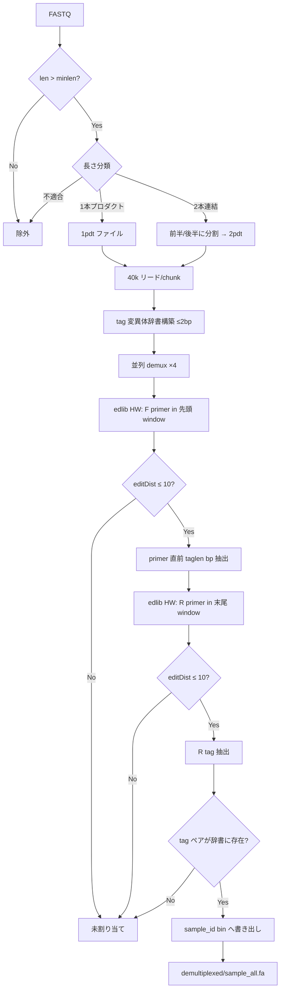

# ONTbarcoder デマルチプレックス手順の整理

作成日: 2026-07-07  
参照: [asrivathsan/ONTbarcoder](https://github.com/asrivathsan/ONTbarcoder)  
主なソース: `ONTbarcoder_multiprocessing.py`（`prepdemultiplex`, `rundemultiplex`）、論文 Methods（BMC Biology, 2021）

---

## 1. 概要

ONTbarcoder のデマルチプレックス（Demultiplexing）は、**デュアルタグ付きアンプリコン**（forward/reverse 各端に primer + tag）を想定している。各リードを **プライマー位置の検出 → tag 配列の切り出し → tag 組み合わせによるサンプル割り当て** の3段階で処理する。

BLAST は使わず、**edlib**（Python）による編集距離アラインメントを用いる。

```
FASTQ
  → 長さフィルタ
  → 1本/2本連結リードの分割
  → チャンク分割（並列化）
  → edlib で F/R プライマー検索（リード両端の限定ウィンドウ）
  → プライマー隣接領域から tag 抽出
  → tag 組み合わせでサンプル bin に振り分け
  → {sample_id}_all.fa
```

---


## 2. 入力ファイル


### 2.1 FASTQ

ベースコール済み FASTQ（MinKNOW / Guppy 等の出力）を入力とする。

### 2.2 デマルチプレックスファイル（CSV）

1行1サンプル。カンマ区切り5列:


| 列   | 内容                | 例                  |
| --- | ----------------- | ------------------ |
| 1   | サンプル ID           | `Specimen_001`     |
| 2   | Forward tag 配列    | 13 bp（実験設計による）     |
| 3   | Reverse tag 配列    | 13 bp              |
| 4   | Forward primer 配列 | 全サンプル共通（1行目から読み取り） |
| 5   | Reverse primer 配列 | 全サンプル共通（1行目から読み取り） |


コード上の読み取り（`prepdemultiplex.run`）:

```python
primerf = demullines[0].split(',')[3]
primerr = demullines[0].split(',')[4].strip()
taglen  = len(demullines[0].split(',')[1])
sampledict[(f_tag, r_tag)] = sample_id  # 列2+列3の組でサンプルを特定
```

論文では tag は **13 bp**、互いに **> 4 bp** 離れている（indel 含む）ことが推奨されている。これにより tag の ±2 bp 許容でも誤割り当てを避けられる。

---


## 3. GUI パラメータ（デフォルト値）

Conventional barcoding モードのデマルチプレックス関連パラメータ（`ONTbarcoder_multiprocessing.py`）:


| パラメータ             | GUI ラベル                          | デフォルト   | 意味                                   |
| ----------------- | -------------------------------- | ------- | ------------------------------------ |
| `minlen`          | Minimum Length                   | **658** | デマルチプレックス対象とするリードの最小長（bp）            |
| `explen`          | Expected barcode length          | **658** | 期待アンプリコン長（COI バーコード長。primer/tag を除く） |
| `demlen`          | Window to define product length  | **100** | 期待長の許容ウィンドウ（±bp）。1本/2本連結の判定に使用       |
| `primersearchlen` | Window for primer and tag search | **100** | プライマー/tag 探索を行うリード両端のウィンドウ長（bp）      |


`postdemlen`（デマルチプレックス後の長さフィルタ、デフォルト 50 bp）はコンセンサス段階で使用し、デマルチプレックス本体には直接関与しない。

---


## 4. 処理手順（詳細）


### Phase 0: デマルチプレックスファイルの読み込み

- サンプル数をカウント
- 共通 F/R primer 配列、tag 長（`taglen`）を取得
- 全ユニーク tag に内部 ID（`t1`, `t2`, ...）を付与


### Phase 1: 長さフィルタ（`prepdemultiplex`）

```
len(read) > minlen  →  候補リードとして保持
```

論文の推奨: `minlen` には **アンプリコン本体長**（primer/tag を含めない長さ）を指定する。ONT リードは indel があるため、理論上の「primer + tag + amplicon」合計より短い/長いリードが混在する。

### Phase 2: 1本/2本連結リードの分類と分割

期待プロダクト長（コード上）:

```
product_len = explen + taglen*2 + primer_f_len + primer_r_len
```


| 条件                                                          | 処理                                                                      |
| ----------------------------------------------------------- | ----------------------------------------------------------------------- |
| `len < product_len + demlen`                                | 1本プロダクトとして `_reformat_out_1pdt` へ                                       |
| `(product_len*2 - demlen) < len < (product_len + demlen)*2` | 2本連結とみなし、前半・後半に分割して `_reformat_out_2pdt` へ（各パートに `p1`/`p2` サフィックス付き ID） |
| 上記以外                                                        | 長さ不適合として除外（`nwronglengthwindow`）                                        |


2本連結の分割位置:

```python
# 前半
sequence[: product_len + demlen]
# 後半
sequence[(product_len - demlen):]
```


### Phase 3: tag 変異体辞書の構築（`crmutant_m2`）

シーケンシングエラーを許容するため、各 tag について **編集距離 ≤ 2** の全変異体を事前生成する（`nbp=2` 固定）。

変異の種類（`create_all_mutants`）:

1. **置換（substitution）**: 各位置を A/T/G/C の他3塩基に置換
2. **削除（deletion）**: 各位置の塩基を削除（先頭/末尾/内部で生成方法が異なる）
3. **挿入（insertion）**: 各位置に A/T/G/C を1塩基挿入

衝突解決:

- 1つの変異 tag が複数の元 tag にマッチする場合（`len(newtags_fr[k]) > 1`）、その変異体は辞書から **削除**
- 衝突しない変異体のみ `muttags_fr` に追加
- `typedict` に変異の段階（0=完全一致, 1=1 bp 差, 2=2 bp 差）を記録

論文の記述「最大 2 bp の差を許容」と一致する。

### Phase 4: チャンク分割と並列化

- 1本プロダクトファイルを **40,000 リード/chunk** に分割
- 2本連結ファイルも同様に分割
- **4 プロセス**の `multiprocessing.Pool` で `rundemultiplex` を並列実行
- 2本連結 chunk は探索ウィンドウを `primersearchlen * 2` に拡大


### Phase 5: プライマー検出（edlib）

各リードについて、リード両端の限定ウィンドウ内でプライマーを検索する。

#### edlib 設定


| 項目                   | 値                                                  |
| -------------------- | -------------------------------------------------- |
| ライブラリ                | `edlib`（Python）                                    |
| mode                 | `HW`（infix / semi-global）。プライマーがリード部分列として存在するケース向け |
| task                 | `path`（位置情報を取得）                                    |
| additionalEqualities | IUPAC アンビギュイティコード（R, Y, S, ...）                    |


#### Forward primer の探索

```python
k1 = edlib.align(pf, read[:primersearchlen], mode='HW', task='path', additionalEqualities=...)
k2 = edlib.align(pf, revcomp(read)[:primersearchlen], mode='HW', task='path', additionalEqualities=...)
# d1 <= d2 かつ d1 <= 10 → 正方向
# d2 < d1  かつ d2 <= 10 → 逆方向（revcomp）
```

- **許容編集距離: ≤ 10**（論文: "Up to 10 deviations from the primer sequence"）
- プライマー位置は **方向・位置の特定のみ** が目的（完全一致は要求しない）


#### Forward tag の抽出

プライマーアラインメント位置 `loc` から、プライマー直前の `taglen` bp を切り出す:

```python
tagseq = read[loc[0] - taglen : loc[0]]   # 正方向の場合
```


#### Reverse primer / tag の探索

F primer 検出後、残り配列（`revseq`）の **末尾** `primersearchlen` **bp** に対して reverse primer（逆相補）をアライン:

```python
pr_rc = revcomp(pr)
k = edlib.align(pr_rc, revseq[-primersearchlen:], mode='HW', task='path', ...)
# editDistance <= 10 で採用
tagseq_r = revcomp(revseq[startpoint + loc[1] + 1 : startpoint + loc[1] + taglen + 1])
```

F/R 両方の tag が取得できたリードのみ、次の tag マッチング段階へ進む。

### Phase 6: tag 組み合わせによるサンプル割り当て（`findmatch_m2`）

1. 各リードについて抽出 tag ペア `(f_tag, r_tag)` を辞書ルックアップ
2. `tagdict`（完全一致 + 変異体）で内部 ID に変換
3. `sampledict[(f_tag_id, r_tag_id)]` でサンプル ID を取得
4. マッチしたリードを `{sample_id}_all.fa` に追記

出力 FASTA ヘッダ例:

```
>{read_id}_{f_tag_edit_dist}_{r_tag_edit_dist}_{cum_score}
```

リード本体は primer 除去済み配列（`fprimercleanfile` 由来）。逆方向リードは塩基をエンコード（A→E, G→F, C→Q, T→P）して方向情報を保持する。

### Phase 7: マージ

4 並列ワーカーの出力 `{sample_id}_all.fa` を `demultiplexed/` ディレクトリにマージする。

---


## 5. edlib 使用箇所の整理


| 用途          | mode                | 閾値                | 探索範囲                                       |
| ----------- | ------------------- | ----------------- | ------------------------------------------ |
| F primer 検出 | HW                  | editDistance ≤ 10 | リード先頭 `primersearchlen` bp（または revcomp 先頭） |
| R primer 検出 | HW                  | editDistance ≤ 10 | F primer 以降の末尾 `primersearchlen` bp        |
| tag マッチング   | 辞書ルックアップ（edlib 不使用） | 事前生成変異体（≤ 2 bp）   | プライマー隣接 `taglen` bp                        |


デマルチプレックス本体では edlib は **プライマー位置・方向の検出** にのみ使用される。tag 自体のマッチングは **事前計算された変異体辞書への完全一致検索** で行う。

---


## 6. 現在の miaoseq `doDemultiplex` との比較


| 項目         | ONTbarcoder                              | miaoseq（現行 `doDemultiplex`）             |
| ---------- | ---------------------------------------- | --------------------------------------- |
| マッチング手法    | edlib（primer）+ 辞書（tag）                   | BLAST（index 配列全体）                       |
| インデックス定義   | tag（短い）+ primer（別管理）                     | index 配列（primer+index 一体、約40 bp）        |
| インデックス入力形式 | sample, f_tag, r_tag, f_primer, r_primer | index_pair_id, f_id, f_seq, r_id, r_seq |
| 探索範囲       | リード両端の固定ウィンドウ                            | リード全体（BLAST DB）                         |
| エラー許容      | primer: ≤10 edits, tag: ≤2 edits         | BLAST mismatch/gap ベースの3段階分類            |
| 位置判定       | edlib locations + primer 隣接切り出し          | BLAST HSP の front/rear 判定               |
| 分類ロジック     | tag ペアの辞書 lookup                         | complete/single/partial match           |
| 並列化        | 4 プロセス × チャンク                            | basecall FASTA chunk ごとに逐次 BLAST        |


---


## 7. miaoseq への edlib 移行で参考になる設定値

ONTbarcoder の実装・論文から、miaoseq の demux ステップで edlib 化する際に検討すべきパラメータ:


| パラメータ            | ONTbarcoder 値        | miaoseq への適用案                                 |
| ---------------- | -------------------- | --------------------------------------------- |
| アラインメント mode     | `HW`（プライマー検索）        | リード端の index マッチングに `HW` または `SHW`             |
| プライマー/index 許容距離 | 10                   | miaoseq の index は長いため、別途調整が必要（例: 比例閾値 or 固定値） |
| tag/index 許容距離   | 2（事前変異体生成）           | 同様に変異体辞書 or edlib `k` パラメータ                   |
| 探索ウィンドウ          | 100 bp（デフォルト）        | `end_window` としてパラメータ化                        |
| 長さフィルタ           | minlen, demlen による分類 | Step 1（basecall）の `size_sel` と役割分担を整理         |
| 衝突解決             | 変異体が複数 tag にマッチしたら棄却 | 同様のロジックを導入                                    |


---


## 8. 処理フロー図




---


## 9. 参考リンク

- リポジトリ: [https://github.com/asrivathsan/ONTbarcoder](https://github.com/asrivathsan/ONTbarcoder)
- 論文: [ONTbarcoder and MinION barcodes (BMC Biology, 2021)](https://doi.org/10.1186/s12915-021-01141-x)
- edlib: [https://github.com/Martinsos/edlib](https://github.com/Martinsos/edlib)
- マニュアル: [Conventional_barcoding_manual.pdf](https://github.com/asrivathsan/ONTbarcoder/blob/main/Conventional_barcoding_manual.pdf)
- 主な実装: `ONTbarcoder_multiprocessing.py` の `prepdemultiplex`, `rundemultiplex`, `findmatch_m2`, `crmutant_m2`

